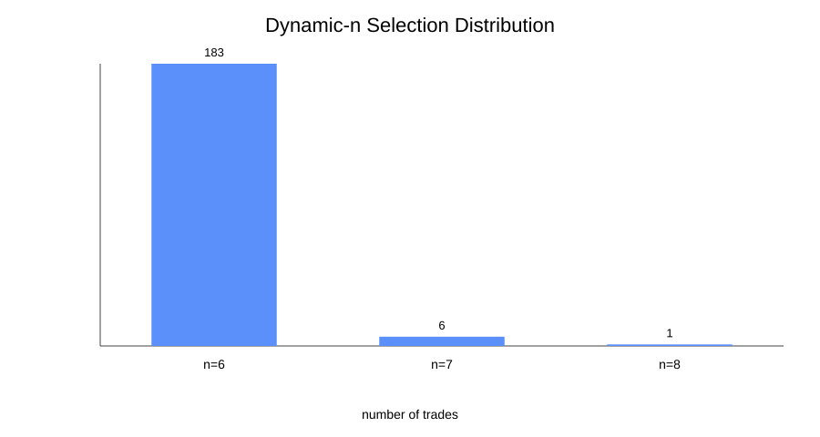

# Corrected Dynamic-n NIFTY Weekly-Options Research Manuscript

**Version:** 2026-10-03  
**Repository branch:** phase-14-dynamic-n-final-manuscript  
**Primary data window:** 2021-05-27 through 2026-09-30  
**Instrument:** NIFTY 50 weekly index options  
**Primary source:** thetrademarkk/india-index-options-1m

---

## Abstract

This study evaluates a corrected dynamic-n three-leg NIFTY weekly-options ratio strategy. The research was restarted after an audit identified two implementation errors in the earlier backtesting engine: incorrect ordinal OTM strike mapping and an inverted long/short P&L sign convention. All earlier dynamic-n numerical results and trade ledgers were therefore discarded and not reused.

The corrected strategy enters exactly four trading sessions before expiry at 10:00 IST. Direction is selected by comparing OTM6/7/8 call and put premium expressions. For the selected side, candidate n values from 6 through 15 are evaluated with the score X_n = P(n+2) + P(n+1) - P(n). The pre-registered higher-n preference uses a 95%-of-maximum eligibility band and selects the highest eligible n. The position buys OTM-n and sells OTM-(n+1) and OTM-(n+2). The target is 90% of the selected X_n multiplied by the historical lot size; otherwise the position exits on expiry using the latest complete three-leg observation at or before 15:29 IST.

Across 190 completed trades, the corrected dynamic-n strategy produced gross P&L of ₹154,742.25 and net P&L of ₹138,937.12 after ₹15,805.13 of modeled costs. Mean net P&L was ₹731.25 per trade, median ₹814.85, net win rate 94.21%, and profit factor 2.14. The bootstrap 95% confidence interval for mean net P&L was ₹145.58 to ₹1,252.17. The strategy selected n=6 on 183 trades, n=7 on 6 trades, and n=8 on 1 trade; no n above 8 was selected under the pre-registered 95% higher-n rule.

A corrected fixed-OTM15 strategy run under the same audited execution framework produced 183 trades and ₹98,560.04 net P&L. On the 180 expiry dates common to both strategies, dynamic-n generated ₹132,977.71 net versus ₹88,176.60 for fixed OTM15, a paired difference of ₹44,801.11. Because the two strategies also use different direction selectors (dynamic OTM6/7/8 versus fixed OTM15/16/17), this comparison is descriptive rather than a pure causal estimate of the value of n-selection.

These results support a positive historical-sample association for the corrected dynamic-n specification, but they do not establish out-of-sample performance or guarantee future profitability. The dominant empirical feature is that the 95%-band rule selected n=6 on 96.3% of completed trades, meaning the dynamic mechanism changed the selected n only rarely in this sample.

---

## 1. Research question

Does a corrected dynamic-n NIFTY weekly-options directional 3-leg ratio strategy, using a pre-registered higher-n preference and realistic execution costs, produce positive historical gross and net returns over the validated executable sample?

Secondary questions:
1. How frequently does the higher-n preference move selection above n=6?
2. How sensitive is the result to target fraction, slippage, entry time, DTE, brokerage, and the higher-n threshold?
3. How does the corrected dynamic-n strategy compare descriptively with the corrected fixed-OTM15 strategy under the same data and cost framework?
4. Are the headline returns driven primarily by frequent target exits, by a small number of large outcomes, or by systematic behavior across years and directions?

---

## 2. Literature and market-context review

### 2.1 Ratio-spread structure and tail exposure

A 1-by-2 ratio spread contains one long option and two further-out short options. Standard references emphasize that the additional short option creates an asymmetric payoff and can introduce substantial or open-ended risk on the adverse side. This structural property is directly relevant because the present strategy is a 1-by-2 ratio structure. Rhoads describes ratio spreads as having more short options than long options and highlights substantial or unlimited adverse risk beyond the short strikes (2012). The Options Industry Council similarly describes a short ratio call spread as one long call and two higher-strike short calls, with the uncovered short option creating potentially unlimited upside loss.

### 2.2 Option-surface selection matters

Israelov and Tummala show that conclusions about option-selling strategies can change materially when option selection is evaluated across the option surface rather than treating all strikes as interchangeable. That supports storing the full n=6..15 candidate scores and the selected n for every executable expiry.

### 2.3 Indian index-option efficiency and transaction costs

Older Indian NIFTY-option research has found conditional efficiency in option pricing and highlighted the importance of volatility measurement. Narayanamurthy and Sehgal (2009) report that historical-volatility specifications described Indian index option values reasonably well under a trading-asymmetry condition, while weighted implied-volatility specifications produced larger pricing errors.

More recent Indian index-option studies emphasize that apparent theoretical mispricing does not automatically translate into implementable trading profits after costs. Kumar, Sarva and Gupta report that transaction costs materially reduce the number of apparent pricing violations that remain economically exploitable. This supports the present project's explicit cost model.

### 2.4 Volatility risk premium and tail risk

Recent NIFTY-focused work provides mixed evidence. Hora (2025) reports a positive variance risk premium using NIFTY and India VIX data. Pillai (2026) reports that several NIFTY short-volatility strategies lose money after realistic frictions, attributing the main losses to tail outcomes rather than transaction costs alone. This distinction is important here because the ratio structure can exhibit many small/medium target outcomes and a smaller number of adverse expiry outcomes.

### 2.5 Relevance to the present study

The literature supports four design principles used here:
- strike selection must be defined precisely;
- ratio structures must be evaluated with tail outcomes rather than win rate alone;
- transaction costs and execution assumptions materially affect implementability;
- results should be tested across the option surface and across robustness specifications rather than interpreted from one backtest configuration.

---

## 3. Strategy specification

### 3.1 Entry

- Four trading sessions before expiry.
- Exact entry time: 10:00 IST.
- ATM: strike nearest the NIFTY spot at 10:00.
- NIFTY weekly/monthly strike interval: ₹50.
- OTM-n means exactly n strike intervals from ATM.
- No ordinal substitution is permitted when a quoted strike is missing.

NSE specifies a ₹50 strike interval for NIFTY weekly and monthly contracts and identifies the NIFTY index-option strike scheme explicitly.

### 3.2 Stage 1 direction

Call-side directional score:

X_call = CE(OTM8) + CE(OTM7) - CE(OTM6)

Put-side directional score:

X_put = PE(OTM8) + PE(OTM7) - PE(OTM6)

Decision:
- X_call > X_put: BEARISH call-side structure.
- X_call < X_put: BULLISH put-side structure.
- Equality: no trade.

### 3.3 Dynamic n

For each n=6,...,15:

X_n = P(OTM(n+2)) + P(OTM(n+1)) - P(OTM n)

All premiums are from the selected call or put side at the same 10:00 snapshot.

### 3.4 Higher-n preference

The primary selection rule is:

X_max = max(X_6,...,X_15)

Eligible n:

X_n >= 0.95 × X_max

Selected:

n_selected = largest eligible n

Thus higher n receives preference whenever it remains within 5% of the maximum candidate score.

This rule was fixed before examining trade outcomes.

### 3.5 Position

For selected n:
- Buy OTM-n.
- Sell OTM-(n+1).
- Sell OTM-(n+2).

### 3.6 Exit

Target:

T = 0.90 × X_selected × lot

The first complete minute after entry with slippage-adjusted gross P&L at or above T is the exit.

Otherwise exit at the latest complete three-leg observation at or before 15:29 IST on expiry day.

No stop loss is used.

---

## 4. Execution and transaction-cost model

The corrected engine uses:
- ₹0.05 adverse option slippage per leg;
- historical NIFTY lot sizes by expiry period;
- six executed orders per completed three-leg round trip;
- Paytm Money brokerage assumption: ₹10 per unique executed F&O order;
- STT, exchange/transaction charges, SEBI/IPFT, stamp duty and GST;
- no forward-filled option prices;
- incomplete three-leg observations excluded and logged.

Paytm Money currently states ₹10 brokerage per unique executed F&O order. NSE's current STT schedule lists 0.15% on option sales from 1 April 2026 and 0.10% through 31 March 2026.

---

## 5. Data

Primary source:
thetrademarkk/india-index-options-1m

Validated executable overlap:
- Start: 2021-05-27
- End: 2026-09-30

The primary universe contained 203 weekly expiry files after excluding each month's maximum expiry as the monthly contract. 190 completed dynamic-n trades were executable after the pre-registered completeness rules.

Excluded/failed expiries were retained in the repository's missing-data log and were not imputed.

---

## 6. Implementation audit and error correction

### Error 1 — OTM strike mapping

The earlier engine interpreted OTM positions as ordinal ranks among available quotes. That could skip exact strikes when a quote was missing.

Correction:
- OTM-n = ATM ± n×₹50 exactly.
- Missing exact strikes are excluded.

### Error 2 — P&L sign convention

The earlier engine inverted the long/short signs.

Correct accounting:
- long leg: exit − entry;
- short leg: entry − exit.

This was independently checked against the supplied AlgoTest call example.

No previous dynamic-n trade ledger or numerical result was reused after these findings.

---

## 7. Primary corrected results

| Metric | Dynamic-n |
|---|---:|
| Completed trades | 190 |
| Gross P&L | ₹154,742.25 |
| Modeled costs | ₹15,805.13 |
| Net P&L | ₹138,937.12 |
| Mean net/trade | ₹731.25 |
| Median net/trade | ₹814.85 |
| Net win rate | 94.21% |
| Profit factor | 2.14 |
| Maximum cumulative drawdown | ₹27,321.08 |
| Target exits | 178 / 190 |
| Expiry exits | 12 / 190 |
| Mean selected n | 6.04 |
| Median selected n | 6 |

---

## 8. Statistical analysis

The trade-level bootstrap used 20,000 resamples.

| Statistic | Result |
|---|---:|
| Mean net P&L | ₹731.25 |
| 95% bootstrap CI for mean | ₹145.58 to ₹1,252.17 |
| 95% bootstrap CI for win rate | 90.53% to 97.37% |
| Trade-level nonannualized Sharpe diagnostic | 0.186 |
| Max drawdown | ₹27,321.08 |

The bootstrap interval remains above zero in this historical sample. This is evidence about resampling variability within the observed sample, not a guarantee of future or out-of-sample profitability.

---

## 9. Dynamic-n selection results

| Selected n | Trades | Net P&L | Mean net |
|---:|---:|---:|---:|
| 6 | 183 | ₹128,616.17 | ₹702.82 |
| 7 | 6 | ₹10,108.11 | ₹1,684.68 |
| 8 | 1 | ₹212.84 | ₹212.84 |
| 9–15 | 0 | ₹0 | — |

The primary 95%-band rule therefore behaved mainly as an n=6 selector. The higher-n preference was exercised, but only rarely.

---

## 10. Direction decomposition

| Direction | Trades | Net P&L | Mean net | Win rate |
|---|---:|---:|---:|---:|
| BEARISH / call | 18 | ₹35,967.81 | ₹1,998.21 | 100.00% |
| BULLISH / put | 172 | ₹102,969.31 | ₹598.66 | 93.60% |

The direction selector is not balanced: the put-side direction occurred on 172 of 190 trades.

---

## 11. Exit decomposition

| Exit | Trades | Net P&L | Mean net | Win rate |
|---|---:|---:|---:|---:|
| TARGET | 178 | ₹258,460.02 | ₹1,452.02 | 100.00% |
| EXPIRY | 12 | -₹119,522.91 | -₹9,960.24 | 8.33% |

This is the key risk-structure result. The aggregate positive performance is produced by many target exits offsetting a small number of very large expiry losses. A high win rate must therefore not be interpreted in isolation.

---

## 12. Calendar-year performance

| Year | Trades | Net P&L | Mean net | Win rate |
|---:|---:|---:|---:|---:|
| 2021 | 20 | ₹13,908.05 | ₹695.40 | 100.00% |
| 2022 | 39 | ₹33,760.20 | ₹865.65 | 94.87% |
| 2023 | 38 | ₹13,274.06 | ₹349.32 | 100.00% |
| 2024 | 37 | ₹7,047.71 | ₹190.48 | 89.19% |
| 2025 | 40 | ₹66,838.47 | ₹1,670.96 | 97.50% |
| 2026* | 16 | ₹4,108.62 | ₹256.79 | 75.00% |

*2026 is partial through 2026-09-30.

---

## 13. Robustness analysis

The primary 95%-threshold result remained positive across every pre-registered sensitivity run.

### Target and slippage

| Scenario | Net P&L |
|---|---:|
| Target 0.80, 0 ticks | ₹115,307.22 |
| Target 0.80, 1 tick | ₹115,307.22 |
| Target 0.90, 0 ticks | ₹139,341.82 |
| Target 0.90, 1 tick | ₹138,937.12 |
| Target 0.90, 2 ticks | ₹138,209.00 |
| Target 1.00, 0 ticks | ₹163,283.90 |
| Target 1.00, 2 ticks | ₹159,292.70 |

### Entry and DTE

| Scenario | Net P&L |
|---|---:|
| 09:45 | ₹115,459.88 |
| 10:15 | ₹171,169.94 |
| 3 DTE | ₹103,865.17 |
| 5 DTE | ₹147,524.39 |

### Brokerage

| Scenario | Net P&L |
|---|---:|
| ₹0/order | ₹152,389.12 |
| ₹10/order | ₹138,937.12 |
| ₹20/order | ₹125,485.12 |

### Higher-n threshold

| Higher-n eligibility threshold | Net P&L | Mean selected n |
|---:|---:|---:|
| 90.0% | ₹143,892.00 | 6.14 |
| 95.0% primary | ₹138,937.12 | 6.04 |
| 97.5% | ₹139,554.81 | 6.02 |

The threshold sensitivity does not show a collapse around the 95% primary value, and the selected-n distribution remains heavily concentrated at n=6.

---

## 14. Comparison with corrected fixed OTM15

The corrected fixed-OTM15 primary used the same audited date range and execution model, but its direction selector uses OTM15/16/17 and its position remains fixed at OTM15/16/17.

| Metric | Dynamic-n | Fixed OTM15 |
|---|---:|---:|
| Trades | 190 | 183 |
| Gross P&L | ₹154,742.25 | ₹112,080.50 |
| Costs | ₹15,805.13 | ₹13,520.46 |
| Net P&L | ₹138,937.12 | ₹98,560.04 |
| Mean net/trade | ₹731.25 | ₹538.58 |
| Median net/trade | ₹814.85 | ₹195.35 |
| Win rate | 94.21% | 99.45% |
| Max drawdown | ₹27,321.08 | ₹3,593.39 |
| Target exit rate | 93.68% | 84.70% |

### Common-expiry paired comparison

There are 180 expiry dates common to both executable trade ledgers.

| Metric | Dynamic-n | Fixed OTM15 |
|---|---:|---:|
| Common-expiry net P&L | ₹132,977.71 | ₹88,176.60 |
| Net difference | +₹44,801.11 | — |
| Mean difference per common expiry | +₹248.90 | — |
| Expiries where dynamic net > fixed net | 93.89% | — |

This comparison is descriptive rather than a clean causal estimate of the value of dynamic n. The strategies differ both in n-selection and in the direction-selector strike family.

---

## 15. Discussion

### 15.1 Main finding

Under the corrected implementation and locked 95%-of-maximum higher-n preference, dynamic-n produced positive historical gross and net P&L over the validated executable sample.

### 15.2 What actually drove the result?

The word dynamic should not be interpreted as frequent n adaptation. The selected n was 6 on 183 of 190 trades.

Thus most of the economic result comes from the n=6 structure, not frequent movement through n=7..15. The dynamic design also changes the direction selector from OTM15/16/17 to OTM6/7/8, so the observed difference against fixed OTM15 reflects both strike-selection and direction-signal differences.

### 15.3 Payoff asymmetry

The 178 target exits collectively produced ₹258.46k net, while 12 expiry exits produced a -₹119.52k aggregate loss. This concentration is consistent with the tail-risk characteristics of ratio structures and short-volatility strategies.

### 15.4 Costs

Modeled costs were ₹15,805.13, approximately 10.2% of gross P&L in the primary dynamic-n run. Removing brokerage raised net P&L to ₹152,389.12, while doubling brokerage to ₹20/order reduced net P&L to ₹125,485.12. Two-tick slippage produced ₹138,209.00 net.

### 15.5 Statistical caution

The bootstrap mean interval is positive, but bootstrap resampling does not address regime change, nonstationarity, parameter uncertainty, execution-model uncertainty or out-of-sample behavior. The result is evidence from a corrected historical backtest, not proof of future profitability.

---

## 16. Strengths

1. Complete restart after material implementation errors were discovered.
2. Exact exchange strike mapping.
3. Independent long/short P&L verification.
4. Pre-registered higher-n selection rule.
5. Explicit slippage, costs and historical lot sizes.
6. Strict no-imputation rule for missing observations.
7. Complete candidate-n and trade-level audit trails.
8. Separate branches and workflows for specification, primary, statistics, robustness and comparison.

---

## 17. Limitations

1. The validated executable sample begins on 2021-05-27 rather than the full AlgoTest report period.
2. Historical bid/ask quotes are unavailable in the primary source, so slippage is modeled rather than reconstructed from historical order books.
3. Dynamic versus fixed OTM15 is not a pure causal experiment because the direction selectors differ.
4. Higher n values have small sample counts.
5. Results are historical and not out-of-sample validated.
6. The target/expiry payoff is highly asymmetric and rare expiry losses remain material.
7. The pre-2024 transaction-cost component contains a conservative assumption where exact broker-level historical pass-through is not directly observable.
8. No claim is made about return on margin or account capital.

---

## 18. Conclusion

The corrected dynamic-n strategy produced ₹138,937.12 net P&L across 190 completed trades under the primary assumptions, with a 94.21% net win rate and profit factor 2.14. All pre-registered robustness families retained positive net P&L in the tested scenarios.

The corrected fixed OTM15 strategy produced ₹98,560.04 net P&L over 183 completed trades. On the 180 common expiry dates, dynamic-n generated ₹44,801.11 more net P&L than fixed OTM15.

However, the central structural result is more nuanced: the higher-n preference selected n=6 on 96.3% of dynamic-n trades. Therefore the present experiment demonstrates a positive corrected dynamic-n historical result, but it does not demonstrate that frequent dynamic movement across n=6..15 is the source of that performance.

The controlled ablation has now been completed. Holding the OTM6/7/8 direction selector constant, fixed n=6 produced ₹139,543.97 net versus ₹138,937.12 for the 95%-band dynamic rule and ₹87,322.86 for fixed n=15. Therefore the primary dynamic rule does not demonstrate an incremental economic benefit from its higher-n preference in this sample.

---

## Appendix A — Exact algorithm

1. Determine expiry and the fourth prior trading session.
2. Read NIFTY spot and option prices at exactly 10:00 IST.
3. Select nearest ATM strike.
4. Construct exact OTM6..17 strikes with the ₹50 strike ladder.
5. Calculate X_call_direction and X_put_direction from OTM6/7/8.
6. Select call or put side.
7. Calculate X_6 through X_15.
8. Compute the 95% eligibility threshold.
9. Select the highest eligible n.
10. Buy OTM-n and sell OTM-(n+1), OTM-(n+2).
11. Apply one adverse ₹0.05 tick per leg.
12. Target = 90% × X_selected × lot.
13. Exit at first complete minute reaching target; otherwise at the last complete observation at or before 15:29 on expiry.
14. Calculate long and short P&L with corrected signs.
15. Subtract modeled transaction charges.
16. Persist the trade, candidate scores and exclusion reason.

---

## Appendix B — Reproducibility artifacts

- Dynamic-n plan: DYNAMIC_N_RESEARCH_PLAN.md
- Dynamic-n specification: DYNAMIC_N_SPEC.md
- Primary backtest code: research/backtest_dynamic_n_corrected.py
- Primary trade ledger: results/dynamic_n_corrected/phase10_primary/trades.csv
- Candidate n ledger: results/dynamic_n_corrected/phase10_primary/candidate_n_scores.csv
- Statistical artifacts: results/dynamic_n_corrected/phase11_statistics/
- Robustness artifacts: results/dynamic_n_corrected/phase12_robustness/
- Comparison artifacts: results/dynamic_n_corrected/phase13_comparison/
- Error log: ERROR_LOG.md
- Research log: RESEARCH_LOG.md

---

## Appendix C — Selected literature and official sources

1. Narayanamurthy, V. & Sehgal, S. (2009). Tests of Pricing Efficiency of the Indian Index Options Market. SSRN 2284731.
2. Israelov, R. & Tummala, H. (2017). Which Index Options Should You Sell? SSRN 2990542.
3. Rhoads, R. (2012). Ratio Spreads, in Option Spread Trading. Wiley. DOI 10.1002/9781119200307.ch11.
4. Dotsis, G. & Vlastakis, N. (2016). Corridor Volatility Risk and Expected Returns. Journal of Futures Markets 36(5), 488-505. DOI 10.1002/fut.21738.
5. Hora, A. (2025). Does the variance risk premium from NIFTY options drive excess returns in a volatility-selling strategy?
6. Pillai, S. (2026). Trading the Volatility Risk Premium on Nifty 50: Strategy Backtest with Realistic Frictions. SSRN 6876580.
7. Pillai, S. (2026). Nifty 50 Index Put Option Mispricing: A BCJ-Style Test 2015-2025. SSRN 6816718.
8. Kumar, A., Sarva, M. & Gupta, N. (2025). Testing Market Efficiency in Indian Index Options Using the Black-Scholes Model: Empirical Analysis and Dynamic Hedging Approach. SSRN 5289505.
9. NSE India. NIFTY 50 F&O / Contract Specifications.
10. NSE India. Securities Transaction Tax.
11. Paytm Money. F&O FAQs and brokerage information.

---

## Supplementary materials

The repository retains the complete trade ledger, candidate-n scores, direction observations, missing-data log, yearly/direction/exit decompositions, robustness scenarios, and paired dynamic-vs-fixed expiry comparison.
