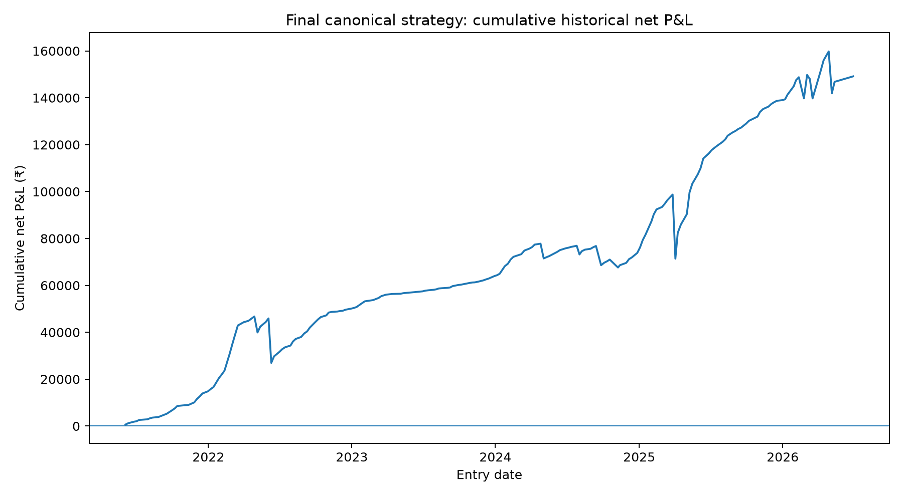
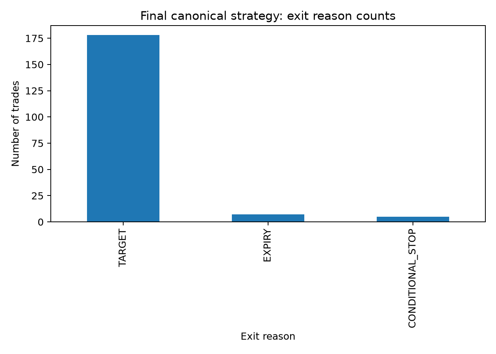
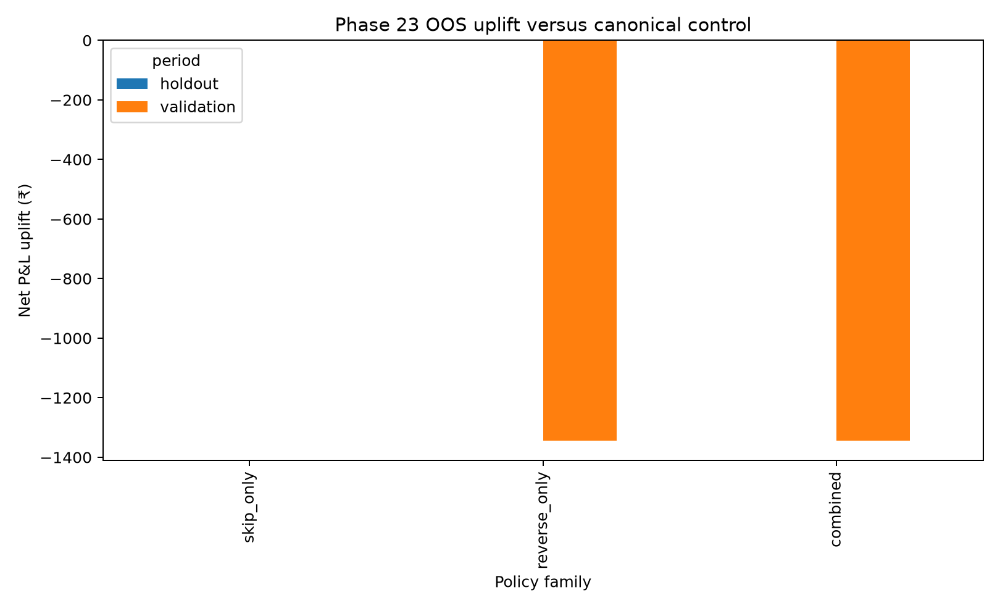
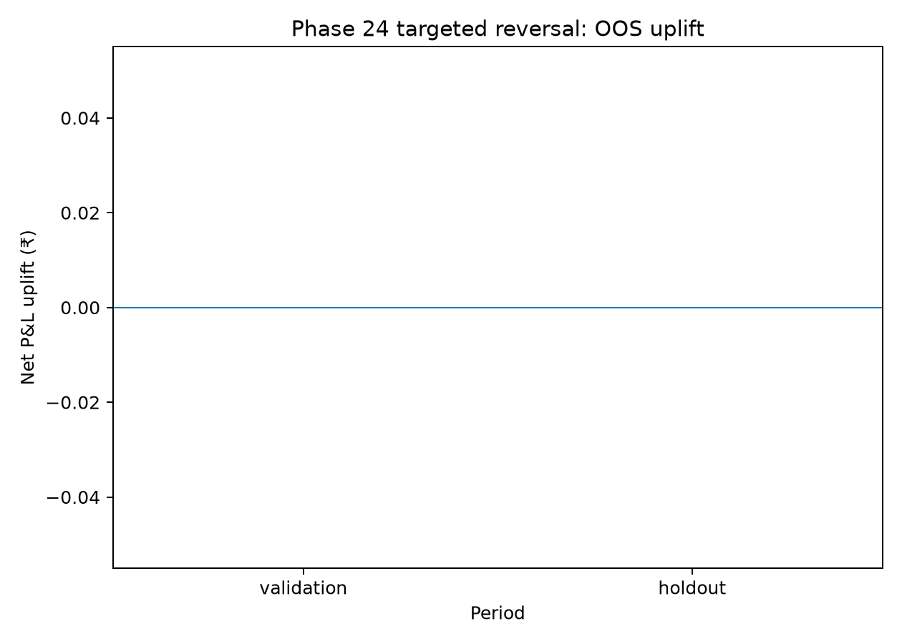

# Final Research Manuscript — NIFTY Corrected Dynamic-n 3-Leg Ratio Strategy

## Abstract

This research investigated a rules-based NIFTY weekly-options strategy that enters four trading sessions before expiry at 10:00 IST, selects call-side or put-side direction from a three-premium expression, chooses a dynamic moneyness parameter n, and constructs a one-long/two-short three-leg ratio structure. The research progressively tested dynamic-n construction, expiry-day risk control, pre-expiry adverse-move controls, simple entry filters, richer entry-state information, and targeted reversal logic.

The final historical specification is the Phase-20 canonical dynamic-n strategy. Across 190 completed trades in the corrected research universe, it produced net P&L of ₹149,129.53, 94.21% profitable trades, profit factor 2.34, and maximum cumulative drawdown of ₹27,336.11 after the research engine's slippage, brokerage, statutory-charge and lot-size assumptions.

Phase 23 and Phase 24 investigated whether richer entry information could change the canonical action. Neither phase passed the preregistered out-of-sample promotion gate. The final conclusion is therefore an unchanged canonical entry-to-exit strategy, accompanied by explicit deployment caveats and a requirement for forward/paper validation before live trading.

## 1. Research questions

1. Can a corrected dynamic-n construction define the three-leg ratio structure without arbitrary fixed moneyness?
2. Can an expiry-day conditional stop reduce adverse tail losses without sacrificing profitable trades?
3. Can large pre-expiry NIFTY adverse moves be controlled deterministically?
4. Can entry-time features identify trades that should be skipped?
5. Can richer entry-state information identify when the opposite option side should replace the canonical direction?
6. Can a narrow reversal trigger exploit the retrospective asymmetry between canonical losses and profitable opposite-side reconstructions without overfitting?

## 2. Aims and objectives

### Aim

To develop and rigorously evaluate a complete, executable NIFTY weekly-options strategy from entry through exit using point-in-time information and explicit execution costs.

### Objectives

- Fix the entry timestamp and strike definitions.
- Determine direction from the preregistered premium expression.
- Determine n from the 95%-of-maximum dynamic rule.
- Evaluate target and expiry-day conditional-stop precedence.
- Test alternative adverse-move controls without relaxing promotion criteria.
- Test entry filters and reversal logic under temporal walk-forward validation.
- Preserve a fully untouched 2026 holdout for final evidence.

## 3. Literature and data review

The study was motivated by several established facts in the options literature rather than by an assumption that they imply profitability for this particular strategy.

NSE describes India VIX as an option-price-derived measure of expected NIFTY volatility over the next 30 calendar days and documents its use of NIFTY option order-book information. The methodology uses time to expiry, the risk-free rate and the forward index level, among other inputs.

Empirical option-return research documents systematic relationships involving moneyness, volatility, liquidity, open interest and implied-volatility characteristics. Coval and Shumway report systematic patterns in S&P index option returns; later studies investigate moneyness and volatility, option liquidity and implied-volatility characteristics. These results support testing such state variables as potential controls, but they do not establish an edge for the present NIFTY strategy.

### Representative sources

- NSE India VIX: https://www.nseindia.com/static/products-services/indices-indiavix-index
- NSE India VIX methodology: https://nsearchives.nseindia.com/s3fs-public/inline-files/India_VIX_comp_meth.pdf
- Coval & Shumway, *Expected Option Returns*: https://papers.ssrn.com/sol3/papers.cfm?abstract_id=239435
- Christoffersen et al., *Liquidity risk and expected option returns*: https://www.sciencedirect.com/science/article/pii/S0378426619302742
- *Moneyness, Underlying Asset Volatility, and the Cross-Section of Option Returns*: https://academic.oup.com/rof/article/27/1/289/6510952
- *Can Equity Option Returns Be Explained by a Factor Model?*: https://academic.oup.com/rfs/article/38/6/1783/8010873
- *Why do option returns change sign from day to night?*: https://www.sciencedirect.com/science/article/pii/S0304405X19302193

The literature review therefore justified examining volatility, moneyness, liquidity/OI/volume and implied-volatility structure, while the research design deliberately avoided treating published cross-sectional findings as evidence that a specific trading rule would work on NIFTY weekly options.

## 4. Data and universe

The corrected backtest uses the project's historical NIFTY option and index data covering 2021-05-27 through 2026-09-30.

The canonical research universe contains 190 completed strategy trades. Phase-23 entry-state modeling achieved exact 190/190 alignment. The reconstructed opposite-side strategy was fully available for 185 of the 190 trades.

Missing exact strikes, missing entry-time spot/option data and incomplete three-leg exit observations were not imputed. No forward filling, interpolation or synthetic quote creation was used.

## 5. Canonical methodology

### 5.1 Entry

For each weekly expiry, the fourth prior trading session is identified. Entry occurs exactly at 10:00 IST.

ATM is the NIFTY strike nearest spot, with a ₹50 strike ladder.

Calls define OTM-n as ATM + n×₹50; puts define OTM-n as ATM − n×₹50.

### 5.2 Direction selector

X_call = CE(OTM8) + CE(OTM7) − CE(OTM6)

X_put = PE(OTM8) + PE(OTM7) − PE(OTM6)

X_call > X_put selects the call-side BEARISH structure.

X_call < X_put selects the put-side BULLISH structure.

Equality or missing required prices causes no trade.

### 5.3 Dynamic n

For n = 6,...,15:

X_n = Premium(OTM(n+2)) + Premium(OTM(n+1)) − Premium(OTM n)

Let X_max = max(X_6,...,X_15).

Eligible n satisfy X_n >= 0.95×X_max.

The largest eligible n is selected.

### 5.4 Position

Buy OTM-n.

Sell OTM-(n+1).

Sell OTM-(n+2).

All legs share the same expiry and option type.

### 5.5 Target

Target = 0.90 × X_selected × lot size.

Exit occurs at the first complete minute where the slippage-adjusted combined three-leg gross P&L reaches target.

### 5.6 Expiry-day conditional stop

At or after 13:30 IST on expiry day, exit when:

- combined three-leg MTM < ₹0; and
- running combined MFE < 0.50×original target.

MFE is the running maximum of slippage-adjusted combined gross P&L from entry.

### 5.7 Expiry fallback

If target and conditional stop do not occur, exit at the latest complete three-leg observation at or before 15:29 IST on expiry.

### 5.8 Exit precedence

1. Target.
2. 13:30 expiry-day conditional stop.
3. 15:29 expiry fallback.

There is no pre-expiry hard stop based only on NIFTY movement and no payoff-boundary/green-area stop.

## 6. Execution-cost model

The historical engine includes:

- one adverse ₹0.05 option tick per leg;
- correct long/short P&L signs;
- date-aware NIFTY lot sizes;
- six executed option orders per completed trade;
- modeled ₹10 brokerage per unique F&O order;
- date-aware transaction/exchange charges, STT, SEBI/IPFT, stamp duty and GST;
- no synthetic option prices.

The research therefore evaluates strategy logic after explicit modeled transaction friction rather than gross premium movement alone.

## 7. Statistical methodology

Research phases used temporal separation rather than random train/test splitting.

- Training: through 2023-12-31.
- Validation: 2024-01-01 through 2025-12-31.
- Holdout: 2026-01-01 through 2026-09-30.

Promotion gates were registered before each relevant phase. Candidate rules were not selected on holdout performance.

For Phase 23 and Phase 24, balanced logistic models were restricted to a small number of preregistered feature groups. Bootstrap resampling was used for P&L-uplift uncertainty summaries.

Because the canonical strategy has only 11 losing trades and the final holdout contains 15 trades, inference is descriptive and uncertainty-aware rather than evidence of a stable population-level effect.

## 8. Results

### 8.1 Final canonical strategy

| Metric | Result |
|---|---:|
| Completed trades | 190 |
| Net P&L | ₹149,129.53 |
| Mean net/trade | ₹784.89 |
| Profitable trades | 179 / 190 |
| Win rate | 94.21% |
| Profit factor | 2.34 |
| Maximum drawdown | ₹27,336.11 |
| Target exits | 178 |
| Conditional-stop exits | 5 |
| Expiry-fallback exits | 7 |
| Baseline-positive trades stopped early | 0 |

The descriptive bootstrap 95% interval for mean trade P&L computed from the 190 trade outcomes is approximately ₹203.16 to ₹1,298.95 around a sample mean of ₹784.89. This is a descriptive resampling interval for the historical sample, not a guarantee about future returns.

### 8.2 Phase 21 — pre-expiry adverse-move risk control

The preregistered adverse-move grid tested 200–600 NIFTY points with several confirmation and MTM/MFE variants, plus a one-lot OTM-(n+3) hedge repair.

No candidate satisfied the training safety constraint. The Phase-21 work was therefore not promoted.

### 8.3 Phase 22 — entry-filter loss avoidance

Pre-entry payoff geometry, direction confidence, structure quality and NIFTY regime filters did not produce a stable loss-removal frontier. No tested filter removed a training loss without also sacrificing profitable trades.

Phase 22 therefore did not alter the canonical entry.

### 8.4 Phase 23 — rich entry-state and directional switch

Phase 23 incorporated entry-time volatility, India VIX, cross-market, opening-state, option OI/volume, IV/skew and payoff-geometry information.

The selected combined policy used loss probability >=0.80 and reverse-superiority probability >=0.70.

Training uplift: +₹23,352.60.

Validation uplift: ₹-1,344.36.

2026 holdout uplift: ₹0.00.

Validation winner retention: 100.0%.

Holdout winner retention: 100.0%.

The promotion gate failed because validation and holdout uplift were not positive.

### 8.5 Phase 24 — targeted reversal

Phase 24 tested only the preregistered two-stage loss-risk/reverse-superiority gates.

No candidate passed the training safety gate.

The closest diagnostic rule used:
- Family B;
- loss probability >=0.85;
- reverse probability >=0.85;
- reverse-minus-loss margin >=−0.10.

Its training uplift was +₹25,202.33, but it sacrificed 7.18% of baseline-positive training P&L, exceeding the 5% preregistered limit.

Validation uplift was ₹0.00.

2026 holdout uplift was ₹0.00.

Neither OOS period reversed a loss.

## 9. Retrospective loss asymmetry

An important descriptive observation is that all 11 historical canonical losing trades had profitable reconstructed opposite-side trades available.

Across these 11 losses:
- canonical loss total ≈ −₹111,651;
- corresponding reverse-trade total ≈ +₹18,075;
- ex-post incremental difference ≈ ₹129,726.

This is strictly a retrospective upper-bound diagnostic. It does not imply that those losses can be identified in real time. Phase 23 and Phase 24 did not demonstrate an out-of-sample trigger capable of harvesting this difference.

## 10. Discussion

The results support three central observations.

First, the final canonical strategy is sensitive to the relationship between option premia, moneyness, time to expiry and execution costs. A dynamic n rule produced a reproducible entry construction without relying on an outcome-optimized fixed OTM distance.

Second, the expiry-day conditional stop was useful within the registered historical framework without affecting baseline-positive trades. In contrast, broad pre-expiry movement stops and payoff-boundary rules were unstable out of sample.

Third, richer entry-state variables did contain predictive structure during parts of the training sample, but this structure was not sufficiently stable to support a deployable reversal or skip rule. In Phase 23, the reverse-only policy changed two validation trades and neither improved their combined outcome. In Phase 24, the stricter trigger took no OOS actions.

The contrast between the retrospective 11-loss asymmetry and the OOS failure of the reversal triggers illustrates why action selection must be separated from retrospective trade inspection.

## 11. Strengths

- Exact entry timestamp and deterministic strike definitions.
- Dynamic n selection fixed independently of trade outcomes.
- Point-in-time feature construction.
- Explicit temporal training/validation/holdout separation.
- Exact-universe alignment checks.
- Explicit slippage, brokerage and statutory-cost modeling.
- No synthetic option marks.
- Pre-registered threshold grids and promotion gates.
- Separate error logging and reproducibility artifacts.
- Final strategy rules are deterministic from entry through exit.

## 12. Limitations

The main limitation is sample size. The canonical strategy produced only 11 losses over 190 trades, and the untouched 2026 holdout contains 15 trades. This limits statistical power, especially for loss classification.

Historical FII/DII, futures-basis and event/news variables were not accepted unless point-in-time timestamps could be verified. The absence of these variables is preferable to leakage, but it means the richer-state model is not a complete representation of the market.

The modeled transaction-cost assumptions approximate execution rather than reproducing every live fill, spread, queue position, partial fill and latency outcome.

The historical universe and option data source may not perfectly represent current microstructure.

## 13. Final conclusion

The complete historical research supports one unchanged strategy specification:

**Enter at 10:00 IST four trading sessions before a weekly expiry; select call/put direction using the X_call versus X_put expression; select n using the 95%-of-maximum rule; buy OTM-n and sell OTM-(n+1)/(n+2); take the 90% target; use the 13:30 expiry-day MTM/MFE conditional stop; otherwise use the 15:29 expiry fallback.**

No Phase-21, Phase-22, Phase-23 or Phase-24 modification passed the required out-of-sample promotion criteria.

This conclusion is historical research evidence, not a claim of future profitability or a recommendation to trade.

## 14. Future research directions

The next research direction should not be another threshold sweep over the same variables.

Meaningful future work would require materially new, timestamp-verified information, such as:

- full intraday implied-volatility surface and term structure;
- verified NIFTY futures basis and futures OI;
- timestamp-safe FII/DII and institutional-flow measures;
- point-in-time macro/event/news state;
- live-quality bid/ask and order-book microstructure;
- regime-aware models tested over longer future validation windows.

Any future model should retain the same no-lookahead discipline, walk-forward validation and untouched forward holdout.

## 15. Complete operational rule card

### Entry

1. Identify the weekly expiry.
2. Identify the fourth prior trading session.
3. At exactly 10:00 IST, record NIFTY spot and the required exact option premiums.
4. Set ATM to the nearest ₹50 strike.
5. Compute X_call and X_put.
6. Select call side if X_call > X_put; put side if X_put > X_call; otherwise no trade.
7. Verify selected X is positive.
8. Compute X_6,...,X_15.
9. Select the largest n with X_n >=0.95×X_max.
10. Buy OTM-n and sell OTM-(n+1) and OTM-(n+2).

### In-trade management

1. Compute slippage-adjusted three-leg gross P&L on complete minute observations.
2. Exit immediately on reaching 90% target.
3. On expiry day from 13:30 onward, exit if MTM <0 and running MFE <0.50×target.
4. Otherwise exit at the last complete three-leg observation at or before 15:29.
5. Apply final transaction charges to obtain realized net P&L.

### Explicitly prohibited substitutions

- no fixed OTM number;
- no ordinal strike substitution;
- no pre-expiry green-area stop;
- no broad fixed NIFTY-point stop;
- no Phase-23 skip/reverse model;
- no Phase-24 reversal trigger.

## Appendix A — research phase map

| Phase | Question | Decision |
|---|---|---|
| 19 | Expiry-day risk-control selection | Retained conditional stop |
| 20 | Payoff-boundary stop | Not promoted |
| 21 | Pre-expiry adverse-move control | Not promoted |
| 22 | Simple entry filters | Not promoted |
| 23 | Rich entry state + canonical/reverse/skip | Not promoted |
| 24 | Targeted reversal trigger | Not promoted |

## Appendix B — key repository artifacts

- FINAL_STRATEGY_RULES.md
- STRATEGY_SPEC.md
- DYNAMIC_N_SPEC.md
- PHASE24_PRE_REGISTRATION.md
- results/dynamic_n_corrected/phase23_entry_state/PHASE23_CONCLUSION.md
- results/dynamic_n_corrected/phase24_targeted_reversal/PHASE24_CONCLUSION.md
- manuscript/PHASE23_ENTRY_STATE_SUPPLEMENT.md
- manuscript/figures/fig1_cumulative_pnl.png
- manuscript/figures/fig2_exit_reason_counts.png
- manuscript/figures/fig3_phase23_oos_uplift.png
- manuscript/figures/fig4_phase24_oos_uplift.png
- manuscript/figures/fig5_trade_pnl_distribution.png

## Appendix C — reproducibility

Every research modification was committed to a dedicated phase branch, automated through GitHub Actions where available, and implementation failures were logged in ERROR_LOG.md. The phase-specific data and result artifacts are retained in the repository so later research can begin from the frozen evidence rather than recomputing or redefining the historical control.

## 8.6 Phase 25 — alternative direction choosers

Phase 25 isolated the direction-selection rule. It tested alternate premium-curvature locations, normalized curvature, relative call/put prices, matched IV spreads, OI/volume PCR in both sign conventions, NIFTY/opening/overnight signals, global-equity direction and fixed aggregate votes. Dynamic-n selection and all exit/cost rules were unchanged.

No candidate passed the preregistered training eligibility gate.

The closest raw-curvature alternatives at k=7 and k=8 produced +₹162.83 training uplift but −₹209.03 validation uplift and ₹0 holdout uplift. An overnight-gap chooser produced +₹1,037.87 in training but −₹127,189.87 in validation and −₹25,293.57 in holdout. The global-equity median produced −₹9,107.76 in training, −₹31,734.34 in validation and +₹8,221.91 in the small 2026 holdout; it therefore failed the preregistered sequence.

Phase 25 therefore provides no evidence sufficient to replace the OTM6/7/8 direction chooser.

See `PHASE25_DIRECTION_CHOOSER_SUPPLEMENT.md` and `results/dynamic_n_corrected/phase25_direction_chooser/PHASE25_CONCLUSION.md`.