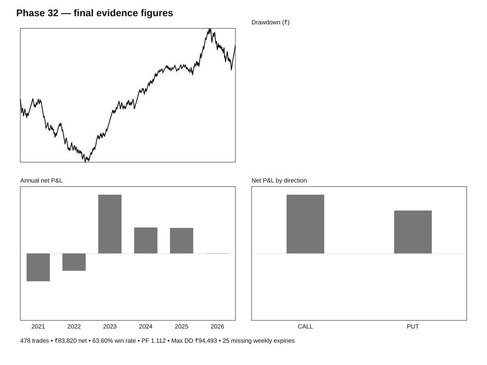

# Phase 32 Research Manuscript — Continuous Delta 6x6 Vertical Spread

## Abstract

This phase independently evaluated the user-specified Continuous Delta 6x6 Vertical Spread on NIFTY 50. The frozen strategy starts with CALL, sells the nearest +0.25-delta option and buys a 50-point higher CE, or the analogous -0.25-delta PE structure. The entire spread exits when the short option reaches the specified 0.50 or 0.04 delta boundaries. After each completed trade, direction is preserved after a positive net result, reversed after a negative net result, and preserved after an exact zero result. No universal daily square-off or discretionary rollover is used.

The final evidence run used reproducible 1-minute historical data, strict chronological state management, explicit historical expiry-calendar transitions, historical NIFTY lot-size exceptions, one-tick-per-order slippage and modeled brokerage/statutory costs. The final sample contained 478 trades and produced ₹83,820.48 net P&L. Despite positive aggregate P&L, the result is not robust enough for promotion: the trade-level mean is not statistically distinguishable from zero, the historical result varies materially by regime, the source contains 25 missing expected expiries plus one incomplete expiry, and the edge disappears under moderate execution deterioration.

Phase classification: PROMISING BUT INSUFFICIENTLY ROBUST.

## 1. Research question and hypothesis

Primary question: Does the frozen continuous direction-following delta spread produce a robust positive historical edge after realistic costs and slippage?

Null hypothesis: the strategy does not demonstrate a stable positive risk-adjusted historical edge after trading frictions and data limitations.

## 2. Strategy specification

Underlying: NIFTY 50.

Capital reference: ₹6,00,000.

Position: 6 lots per leg, 50-point spread.

Entry: from 09:20 IST, not on expiry day, flat before entry; CALL at nearest +0.25 delta with long strike +50; PUT at nearest -0.25 delta with long strike -50.

Fresh entries are blocked in the final 120 seconds before the 15:30 close.

Exit: CALL when short CE delta is >= +0.50 or <= +0.04; PUT when short PE delta is <= -0.50 or >= -0.04.

Direction: start CALL; positive net trade keeps direction; negative net trade flips direction; zero net trade keeps direction.

No universal daily square-off. No discretionary rollover.

The historical test is a 1-minute-bar approximation to the intended tick-driven live strategy.

## 3. Methodology

Observed 1-minute NIFTY spot and option prices were used with exact common timestamps. No forward filling or interpolation was permitted.

Entry strikes were selected using Black–Scholes implied-volatility inversion and the corresponding delta. Exit monitoring used the first qualifying minute observation. The final state machine is strictly chronological: a new trade cannot occur before the preceding trade's actual exit.

Contract windows are bounded by the expected calendar expiry sequence, not by the availability sequence of data files. This prevents missing historical expiry files from enlarging the next contract's entry window.

The historical expiry schedule incorporates NSE's Thursday schedule, the temporary Monday schedule in April–August 2025, and the Tuesday schedule from September 2025 onward, with holiday adjustment.

Historical NIFTY lot-size transitions and exceptions were encoded by expiry cycle, including July 2021, the 2024 reduction, the January 2025 weekly/monthly transition, and the 2026 transition.

The execution model uses one ₹0.05 slippage tick per order, four orders per round-trip spread trade, ₹10 brokerage per executed order, and date-dependent statutory charges.

## 4. Primary result

| Metric | Result |
|---|---:|
| Trades | 478 |
| Net P&L | ₹83,820.48 |
| Gross P&L after modeled slippage | ₹127,321.50 |
| Modeled brokerage/statutory costs | ₹43,501.02 |
| Win rate | 63.60% |
| Profit factor | 1.112 |
| Mean net/trade | ₹175.36 |
| Median net/trade | ₹2,064.93 |
| Maximum drawdown | ₹94,492.83 |
| Max drawdown / ₹6 lakh | 15.75% |
| CALL trades | 222 |
| PUT trades | 256 |
| Delta exits | 477 |
| Contract-termination exits | 1 |
| Median holding time | 70.99 hours |

The reconstructed one-tick slippage drag is approximately ₹29,442 under the four-order model. Therefore the pre-slippage price-move P&L is approximately ₹156,763.50 before brokerage/statutory charges.

## 5. Calendar-year findings

| Year | Trades | Net P&L | Win rate |
|---|---:|---:|---:|
| 2021 | 60 | -₹35,811.73 | 55.0% |
| 2022 | 110 | -₹22,294.75 | 57.3% |
| 2023 | 101 | +₹75,763.63 | 71.3% |
| 2024 | 109 | +₹33,501.40 | 67.9% |
| 2025 | 64 | +₹32,937.58 | 62.5% |
| 2026* | 34 | -₹275.65 | 64.7% |

2021–2022 lost approximately ₹58.1k. 2023–2025 gained approximately ₹142.2k. The available 2026 segment is essentially flat/negative.

## 6. Statistical analysis

Mean trade P&L = ₹175.36.

Median trade P&L = ₹2,064.93.

Standard deviation = ₹3,639.31.

Two-sided one-sample t-test p-value = 0.293.

95% bootstrap CI for mean trade P&L = approximately -₹156 to +₹494.

95% bootstrap interval for aggregate resampled P&L = approximately -₹71.9k to +₹238.6k.

The positive win rate is not enough to establish a positive expected trade value because the loss distribution is much larger than the typical win. The profit factor of 1.112 is weak relative to the drawdown.

## 7. Execution robustness

Same-sequence slippage sensitivity:

| Slippage per order | Net P&L |
|---:|---:|
| 0 ticks | ₹113,262.48 |
| 1 tick | ₹83,820.48 |
| 2 ticks | ₹54,378.48 |
| 3 ticks | ₹24,936.48 |
| 4 ticks | -₹4,505.52 |
| 5 ticks | -₹33,947.52 |

No individual trade changed sign through the 5-tick sensitivity, so direction sequencing remained unchanged in this analysis.

A ₹20/order brokerage sensitivity, including the incremental GST effect, reduces the same trade sequence to approximately ₹61,258.88. Combining ₹20/order brokerage with 3 ticks of slippage leaves only approximately ₹2,374.88; 4 ticks makes the result negative.

## 8. Data coverage

The requested period ended 30-Sep-2026.

The final reproducible coverage contained:

- 264 expected expiries.
- 239 available expiry files.
- 25 missing expiry files.
- 1 incomplete available expiry.
- 238 processed expiries.
- Last complete trade-producing expiry: 19-May-2026.
- The 09-Jun-2026 file was incomplete.

The largest missing block is April–August 2025, overlapping a structural NIFTY expiry-calendar transition. These missing weeks cannot be treated as zero-opportunity periods.

## 9. Trading-calendar audit

The ledger contains weekend-dated trades on 02-Mar-2024 and 01-Feb-2026. These are valid special NSE sessions rather than data errors: NSE operated special live equity/index-derivatives sessions on those dates.

## 10. Strengths

The major strength is implementation discipline rather than headline profitability. The final engine prevents overlapping trades and future-exit look-ahead, handles exact zero-net direction state, explicitly models historical lot-size changes, records missing data, and persists a complete trade ledger from a successful GitHub Actions run.

## 11. Limitations

The source is 1-minute rather than tick-level. Bid/ask microstructure, queue position, partial fills and market impact are unavailable. Exact user-specific Paytm Money historical brokerage is unknown. Exchange transaction charges are modeled rather than reconstructed from broker-level monthly slab billing. The source is incomplete through the requested 2026 end date. Delta is model-derived rather than exchange-published. Contract termination uses the final reproducible common observation rather than a complete exchange settlement reconstruction.

## 12. Discussion

The strategy has an internally coherent structure and showed a strong positive period in 2023–2025. However, the evidence does not demonstrate a stable cross-regime edge. The substantial losses in 2021–2022, flat/negative available 2026, low profit factor, high relative drawdown and execution sensitivity make the result unattractive for deployment without better data.

The missing 2025 expiry block is particularly important because it overlaps the expiry-day regime transition. Consequently the current evidence cannot establish how the strategy behaves through the full calendar transition.

## 13. Conclusion

The tested strategy is profitable on the available historical sample but **does not meet the Phase-32 promotion standard**.

Final classification: **PROMISING BUT INSUFFICIENTLY ROBUST**.

Phase-20 remains the canonical historical strategy. No Phase-32 threshold, spread-width, direction-chooser, re-entry rule or stop rule is promoted.

## 14. Future research

Future work should be restricted to measurement and data validation:

1. Acquire complete 1-minute or tick-level NIFTY options through September 2026.
2. Reconcile the April–August 2025 missing expiry history.
3. Independently validate the delta calculation.
4. Reconstruct actual historical Paytm Money charges for the account cohort.
5. Re-run the already frozen strategy before considering any strategy modification.

## 15. Final rule card

Entry: from 09:20 IST, not expiry day, flat before entry, initial CALL; CALL = short nearest +0.25 CE and long +50; PUT = short nearest -0.25 PE and long -50; block fresh entries in the final 120 seconds.

Exit: CALL when short CE delta >= +0.50 or <= +0.04; PUT when short PE delta <= -0.50 or >= -0.04; no daily universal square-off; no discretionary rollover; contract-termination fallback if no delta trigger occurs.

Direction: positive net P&L keeps direction; negative net P&L flips; zero net P&L keeps direction.

This is the tested rule set, not a live-trading recommendation.

## 16. Evidence identifiers

Final code revision: f89e1e5574aa26b69288ae93b9cf180bf9882242.

Final GitHub Actions run: 37388261915, run #41.

Final artifact ID: 11380124540.

Final artifact SHA-256: c97657e5ec4acd4023e133e82cb586b242f030f7ef76985638fcdbcf0b84943.

Branch: phase-32-continuous-delta-6x6-backtest.

## References

NSE Circular 28/2021: https://archives.nseindia.com/content/circulars/FAOP47854.pdf

NSE 2025 expiry-day revision: https://nsearchives.nseindia.com/content/circulars/FAOP68685.pdf

NSE 2025 expiry transition annexure: https://nsearchives.nseindia.com/content/circulars/FAOP68747.pdf

NSE STT schedule: https://www.nseindia.com/static/products-services/equity-derivatives-securities-transaction-tax

Paytm Money current F&O brokerage FAQ: https://www.paytmmoney.com/stocks/customer/fno-faq/onboarding-and-kyc/account-segment-activation/how-to-activate-fo-from-mobile-app-web

Paytm Money historical brokerage notice: https://www.paytmmoney.com/blog/brokerage-charges-increase-from-25th-aug-23-existing-users-will-continue-on-old-brokerage-charges/

NSE 02-Mar-2024 special session: https://nsearchives.nseindia.com/content/circulars/MSD60677.pdf

NSE 01-Feb-2026 special session: https://nsearchives.nseindia.com/content/circulars/FAOP72352.pdf

## 17. Figures and supplements

See the [literature and external-evidence supplement](../results/dynamic_strategy_phase32/PHASE32_LITERATURE_REVIEW.md), the [frozen rule card](../results/dynamic_strategy_phase32/PHASE32_STRATEGY_RULES.md), the [results index](../results/dynamic_strategy_phase32/PHASE32_RESULTS_INDEX.md), and the [final statistical summary](../results/dynamic_strategy_phase32/PHASE32_STATISTICAL_SUMMARY.csv).
