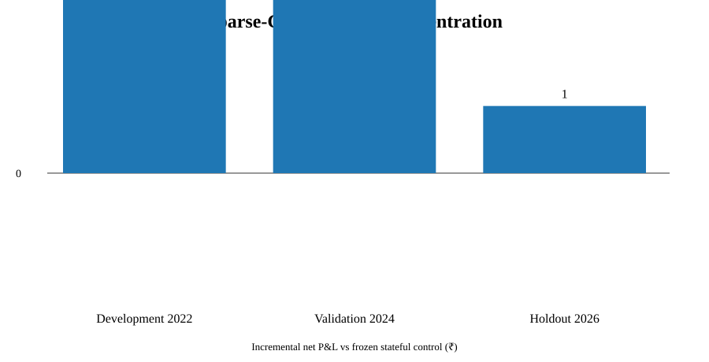
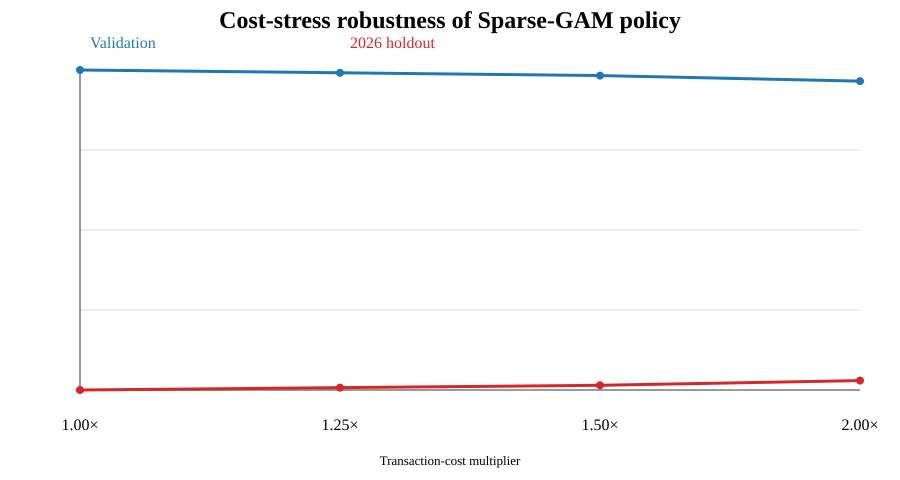

# Phase 39 Research Manuscript
## Control-Relative Counterfactual Direction Learning for NIFTY Continuous Delta 6x6 Spreads

**Branch:** `phase-39-advanced-direction-models`  
**Status:** Final phase closeout; no promotion to canonical strategy.

### Abstract

Phase 39 investigated whether direction selection for the NIFTY Continuous Delta 6x6 vertical-spread strategy could be improved by changing the prediction target from generic market direction to the economic decision actually faced at entry: the post-cost P&L difference between the CALL-side and PUT-side spread.

A fixed-opportunity counterfactual panel of 477 historical entry opportunities was constructed under the frozen execution framework, with 271 development observations, 172 validation observations and an untouched 34-opportunity 2026 holdout. Point-in-time features covered NIFTY price/volatility, option premium/IV/OI/volume/skew/term structure, global markets, FII/DII flows and sentiment where timestamp-valid data existed. The first model screen tested counterfactual margin learners including Bayesian/regularized methods, pairwise preference, dynamic Bayesian-style models, Gaussian-process methods, sparse GAMs and weighted kNN. The best validation configuration was a Sparse-GAM economic-margin learner with a ₹500 safety margin and a 1.0× predictive-uncertainty penalty.

Replayed chronologically as a sequential policy, the model made seven overrides of the canonical stateful direction rule. The accepted sequential result improved net P&L by ₹17,983.53 in 2024–2025 validation and ₹7,390.39 in the 2026 holdout. The improvement remained positive under +50% and +100% transaction-cost stress, and 2026 maximum drawdown improved relative to the frozen control. However, development-period incremental P&L was −₹18,175.07, the entire OOS improvement came from only seven overrides, and the paired-expiry interval remained compatible with zero. Therefore the candidate was **not promoted**. The canonical stateful Phase-32 direction rule remains unchanged.

### 1. Research question

Can an action-aware counterfactual model identify rare entry situations in which switching from the canonical CALL/PUT stateful direction to the opposite continuous-delta spread produces durable post-cost economic benefit without worsening drawdown?

Secondary questions:

- Does direct prediction of `CALL_net − PUT_net` outperform indirect NIFTY-direction prediction?
- Can uncertainty-aware abstention improve only the highest-conviction opportunities?
- Do analog, regime-gated, sparse nonlinear and expert-aggregation methods add information beyond the economic-margin learner?
- Does any new selector survive transaction-cost stress and chronological sequential replay?

### 2. Hypothesis

The core hypothesis was that the trading decision is better represented by an economic counterfactual margin than by a generic up/down label:

`DeltaP&L = NetP&L(CALL spread) - NetP&L(PUT spread)`.

The canonical stateful direction remained the default action. The new model was allowed to override the control only when expected alternative-side improvement exceeded a safety margin after a predictive-uncertainty penalty.

### 3. Frozen control and execution assumptions

The comparator was the frozen accepted Phase-32 stateful Continuous Delta 6x6 strategy:

- NIFTY 50 weekly 50-point vertical spread.
- Six lots per leg.
- Initial direction CALL.
- Winning trade retains direction; losing trade flips direction; zero retains direction.
- Entry and exit are determined by the same continuous-delta execution engine as the frozen control.
- One-tick adverse slippage and the frozen brokerage/statutory/exchange cost model are retained.
- Chronological non-overlap is enforced.
- Historical lot-size schedule is retained.

The Phase-39 work changed the direction-selection layer only. The current live Paytm Money tariff schedule was not separately substituted into the historical engine; live deployment therefore requires broker-specific cost reconciliation before paper/live execution.

### 4. Data architecture

Two datasets were kept separate.

#### 4.1 Fixed-opportunity counterfactual panel

Every accepted opportunity has both hypothetical arms calculated at the same entry timestamp:

- CALL spread net P&L.
- PUT spread net P&L.
- `DeltaP&L`.
- Control direction and control net P&L.
- Exit timestamps for both counterfactual arms.

The panel contains 477 unique opportunities:
- Development: 271.
- Validation: 172.
- Holdout: 34.

The frozen validation+holdout control aggregate is ₹63,672.5753, reconstructed with sub-paise numerical error.

#### 4.2 Sequential policy replay

A learned selector was replayed chronologically. Its selected arm determines its realized exit timestamp, which determines when the next position can be opened. This avoids the common fixed-opportunity fallacy in which a changed action is allowed to retain the control's future entry schedule.

Only the sequential replay can support a trading-policy conclusion.

### 5. Point-in-time features

The feature layer included, where timestamp-valid:

- NIFTY intraday returns, ranges, realized volatility and momentum.
- ATM and 25-delta option premiums, IV, OI, volume and deltas.
- Relative premium/credit and IV-skew measures.
- OI/volume PCR measures.
- Near- and next-expiry term structure.
- NIFTY daily regime variables.
- Global S&P 500, NASDAQ, DOW, VIX, NIKKEI, SENSEX, USD/INR, gold and crude variables.
- FII/DII and index-flow z-scores.
- Timestamp-valid sentiment features.

A leakage audit was performed. Development OOF feature eligibility was corrected so that feature selection for each OOF block uses only the preceding training observations.

### 6. Candidate model families

The registered program was deliberately broader than another generic classifier sweep.

#### 6.1 Economic-margin models

- Control-Relative Counterfactual Override Learner (CROL).
- Bayesian/regularized margin regression.
- Bradley–Terry pairwise preference.
- Dynamic Bayesian-style logistic/model averaging.
- Gaussian-process margin regression.
- Sparse GAM / GA2M-style additive model.
- Weighted kNN analog forecasting.

#### 6.2 Advanced analog/regime models

- DTW analog margin forecasting.
- RBF/SVR margin regression.
- Bayesian online change-point gated GAM.

#### 6.3 Final exploratory families

- Constrained sparse quadratic/Elastic-Net economic-margin model.
- Full-information expert aggregation diagnostic combining canonical control, point-in-time premium geometry and Sparse-GAM.

2026 holdout was not used to select any of these alternatives after the candidate lock.

### 7. Statistical methods

Primary outcomes:

- Incremental net P&L relative to the frozen control.
- Paired common-expiry bootstrap with 10,000 deterministic resamples.
- Maximum drawdown.
- Win rate and net-P&L distribution.
- Validation/holdout stability.
- Cost-stress robustness.

Cost stress:

- Base cost.
- +25% costs.
- +50% costs.
- +100% costs.

The phase did not use random k-fold validation or random train/test splitting.

### 8. Fixed-opportunity model screen

The strongest validation configuration was Sparse-GAM economic-margin learning.

| Model | Validation uplift | Validation overrides | Decision |
|---|---:|---:|---|
| Sparse-GAM | **+₹11,609.60** | 2 | Best fixed-opportunity candidate |
| CROL/Bayesian margin | ~₹0 | 0 | Reject |
| Bradley–Terry | ~₹0 | 0 | Reject |
| Dynamic Bayesian logistic | ~₹0 | 0 | Reject |
| Gaussian process | ~₹0 | 0 | Reject |
| Weighted kNN | ~₹0 | 0 | Reject |
| DTW | ~₹0 | 0 | Reject |
| SVR | ~₹0 | 0 | Reject |
| BOCPD-GAM | **+₹11,609.60** | 2 | Redundant with Sparse-GAM |
| Sparse symbolic model | **−₹8,760.83** | Not useful | Reject |

The Sparse-GAM paired-expiry validation bootstrap interval for total uplift was approximately **−₹1,250 to +₹36,079**, so the positive estimate did not establish a decisive effect.

### 9. Sequential policy result

The accepted sequential Sparse-GAM candidate used:

- Default: canonical stateful direction.
- Predictive target: `DeltaP&L`.
- Uncertainty penalty: 1.0× predictive residual scale.
- Override safety margin: ₹500.
- Warm-up: 100 completed historical opportunities before model-driven overrides.

It produced 479 sequential trades and seven overrides.

| Period | Policy net P&L | Control net P&L | Incremental P&L | Policy max DD |
|---|---:|---:|---:|---:|
| Development | −₹517.92 | ₹17,657.15 | **−₹18,175.07** | ₹102,461.48 |
| Validation | ₹81,931.75 | ₹63,948.22 | **+₹17,983.53** | ₹32,021.65 |
| 2026 holdout | ₹7,114.74 | −₹275.65 | **+₹7,390.39** | ₹29,936.24 |

The control's 2026 drawdown was ₹37,326.63, so the candidate reduced holdout maximum drawdown by approximately ₹7,390.

### 10. Override concentration

The seven overrides were highly concentrated:

| Period | Overrides | Result |
|---|---:|---|
| 2022 development | 3 | Net negative contribution |
| June 2024 validation | 3 | All profitable |
| March 2026 holdout | 1 | Profitable |

This concentration is consistent with the intended “rare override” design, but it also makes the positive effect statistically fragile.

### 11. Cost-stress analysis

The candidate remained incrementally positive under every tested cost multiplier.

| Cost multiplier | Validation uplift | 2026 holdout uplift |
|---|---:|---:|
| 1.00× | ₹17,983.53 | ₹7,390.39 |
| 1.25× | ₹17,891.29 | ₹7,468.36 |
| 1.50× | ₹17,799.05 | ₹7,546.34 |
| 2.00× | ₹17,614.56 | ₹7,702.28 |

The absolute uplift therefore does not depend on an unrealistically tight historical cost assumption. However, cost-stress robustness does not remove the development-period weakness.

### 12. Advanced-family findings

DTW analog and SVR models generated no validation overrides at their selected development thresholds.

BOCPD-gated GAM reproduced the same fixed-opportunity validation uplift as Sparse-GAM. It therefore did not provide independent evidence of a separate regime advantage.

The constrained sparse quadratic/Elastic-Net symbolic model produced **−₹8,760.83** validation uplift, with a bootstrap interval spanning a wide range and a positive-resample probability of only 0.3308.

The full-information expert-aggregation diagnostic matched the control's validation result at the selected learning rate. Because its historical weight updates use counterfactual rewards for all experts, it is a **research diagnostic, not a directly deployable online policy**.

### 13. Strengths

1. The research target is economically aligned with the actual CALL-versus-PUT choice.
2. Both counterfactual arms are evaluated at the same historical opportunity.
3. Sequential replay removes the future-entry scheduling bias.
4. Development, validation and 2026 holdout are temporally separated.
5. Leakage controls include point-in-time feature sourcing and corrected chronological OOF feature selection.
6. Transaction costs and adverse slippage remain in the execution engine.
7. Multiple alternative model families were screened rather than promoting the first positive result.
8. Cost stress and drawdown were explicitly evaluated.

### 14. Limitations

1. The independent opportunity count is still small for high-capacity statistical learning.
2. Only seven sequential overrides generated the positive OOS increment.
3. The development period is negative, so regime dependence remains unresolved.
4. The paired-expiry bootstrap interval crosses zero.
5. Several historical external data families remain incomplete at the timestamp level, particularly some breadth, futures-basis and news/corporate-action series.
6. The expert aggregation diagnostic used full counterfactual reward information and is therefore not a live-ready policy.
7. The historical cost model is inherited from the frozen strategy; current Paytm Money-specific live fees, fills and latency must be reconciled independently before deployment.
8. The 2026 holdout is only 34 fixed opportunities / 20 expiry blocks.

### 15. Scientific discussion

The central finding is not that Sparse-GAM has established a production edge. It has not.

The more important finding is that **economic-margin learning can produce selective improvements with very low intervention frequency**, and that this mechanism is qualitatively different from replacing the direction classifier. In 2024–2026 the seven overrides were mostly favorable, while the same rule did not work in development. This is evidence for a possible regime-dependent interaction between the canonical state transition and entry-time option geometry.

At the same time, the negative development result is a strong warning against promotion. A genuinely durable selector should produce a positive contribution before validation while retaining positive out-of-sample performance. Phase 39 did not demonstrate that.

The evidence therefore supports a conservative interpretation: counterfactual economic learning is a promising **research direction**, not a validated replacement.

### 16. Conclusion

Phase 39 does **not** change the canonical trading strategy.

The canonical Phase-32 stateful direction rule remains the accepted historical control.

The strongest new research candidate is:

> **Canonical direction by default; switch to the alternative side only when the Sparse-GAM counterfactual economic-margin estimate, penalized by 1× predictive uncertainty, exceeds ₹500.**

This rule should remain a research candidate only. A future promotion requires a new phase with fresh forward/paper execution, broker-specific costs, and a prospective validation design.

### 17. Future research

The highest-value next phase is not another indiscriminate classifier sweep. It should focus on:

1. Prospective/paper validation of the seven-override mechanism with live NIFTY option quotes, Paytm Money fills, latency and exact broker charges.
2. Regime-conditional validation of the counterfactual margin, especially distinguishing 2022-like development conditions from 2024–2026.
3. Better point-in-time futures basis/OI, breadth and corporate-action/news data.
4. A deployable bandit-style expert aggregation method that does not use unobserved counterfactual rewards for the selected-away experts.
5. Independent replication on a future time block after the current holdout.

### 18. Reproducibility and repository record

The complete research record is stored in:

- `PHASE39_RESEARCH_PLAN.md`
- `PHASE39_PRE_REGISTRATION.md`
- `PHASE39_LITERATURE_REVIEW.md`
- `PHASE39_STATUS.md`
- `ERROR_LOG.md`
- `results/phase39_counterfactual/`
- `results/phase39_models/`
- `results/phase39_sequential_policy/`
- `results/phase39_sequential_policy_audit/`
- `results/phase39_advanced_screen/`
- `results/phase39_final_exploratory/`

### Appendix A — Phase chronology

1. Freeze counterfactual control and reconstruct the 477-row panel.
2. Build point-in-time feature matrix and leakage audit.
3. Screen economic-margin models chronologically.
4. Replay the best candidate sequentially.
5. Audit chronology, drawdown and cost stress.
6. Screen analog, kernel and regime-gated models.
7. Screen constrained symbolic and expert aggregation diagnostics.
8. Freeze the phase without promotion.

### Appendix B — Phase stop rule

Phase 39 stops because the registered candidate families have been screened and the strongest candidate fails the promotion gate despite positive validation and 2026 holdout increments. No further Phase-39 model family should be added without a new phase.

### Appendix C — Companion result figures

- [Sequential incremental P&L](assets/phase39_uplift.svg)
- [Cost-stress robustness](assets/phase39_cost_stress.svg)
- [Override concentration](assets/phase39_overrides.svg)
