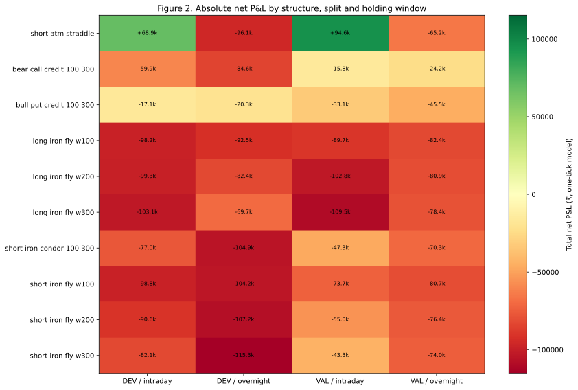
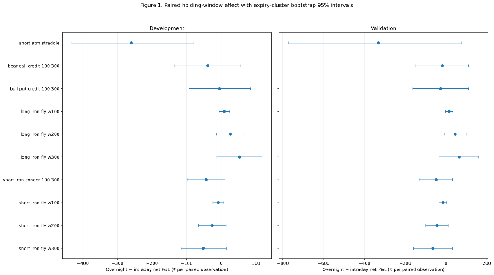

# Intraday versus Overnight Holding Windows in NIFTY Option Structures: A Cost-Aware, Expiry-Clustered Study

**Study package:** Final Stand v5 1-1-1-1, Phases 80–83  
**Analysis date:** 10 October 2026  
**Research status:** Complete for the registered structure/horizon experiment; no new strategy promoted  
**Data split:** Development through 31 December 2023; validation 1 January 2024–31 December 2025; 2026 holdout sealed  
**Companion report:** [Phase 81 sweep results](https://github.com/vishnuvcr/Final-Stand-v5-1-1-1/blob/phase-81-intraday-overnight-structure-sweep/results/phase81_intraday_overnight/report.md) and [Phase 82 inference report](https://github.com/vishnuvcr/Final-Stand-v5-1-1-1/blob/phase-82-expiry-cluster-inference/results/phase82_expiry_cluster_inference/report.md)

## Abstract

### Background
The project had previously explored many option structures, volatility regimes, entry filters and exit rules, but not a systematic matched comparison of intraday versus overnight holding windows across the same static option-structure templates. Published research on delta-hedged NIFTY options reports different intraday and overnight return behaviour, motivating—but not proving—the value of testing the exposure clock.

### Objective
Compare registered intraday and overnight windows using the same session, expiry, spot-based ATM anchor and structure template, with modeled Paytm Money brokerage, historical statutory fees and adverse slippage. Estimate paired overnight-minus-intraday net outcomes with expiry-cluster-aware uncertainty and family-wise error correction.

### Methods
Ten registered structure variants were evaluated using a pinned one-minute options dataset, with development and validation splits ending 31 December 2025. Intraday trades use the 09:20 bar open to the 15:20 open. Overnight trades use the 15:20 open to the next eligible session’s 09:20 open. Both windows share the 09:19 spot-close ATM anchor. Exact expiry/side/strike/timestamp and valid-volume requirements were enforced; no forward filling or synthetic bars were permitted. The primary model applies a ₹0.05 adverse tick per leg per fill and assumed Paytm Money brokerage of ₹10 per executed order plus a frozen date-aware statutory fee model; ₹0.10 adverse slippage is the registered stress. Phase 82 ran expiry-cluster-robust t tests and 10,000 expiry-cluster bootstrap replicates per test, with Holm adjustment over 20 primary hypotheses.

### Results
The corrected sweep produced 11,163 matched date×variant comparisons across 238 expiry files; 182 incomplete cases were excluded, with zero file/schema errors. All nine defined-risk structures had negative aggregate net P&L in both development and validation at both registered friction levels. The unbounded-risk short ATM straddle showed positive aggregate intraday P&L but negative aggregate overnight P&L; it was diagnostic-only and not eligible for promotion. None of the 20 primary tests survived Holm correction at 5%. One development-only short-straddle timing comparison had a raw p-value of 0.0040 but a Holm-adjusted p-value of 0.0807. None of the 18 defined-risk structure–horizon candidates passed the frozen absolute-profit gate. The 2026 holdout was not accessed.

### Conclusion
Within this bounded set of static NIFTY structures and OHLC-open execution proxies, the study found no defined-risk candidate that met the frozen profitability gates and no statistically significant holding-window effect after family-wise correction. The result is a no-go for promoting a new strategy from this experiment—not proof that every possible options strategy is unprofitable. Quotes/depth-quality execution evidence is still required for a credible tradability assessment.

**Keywords:** NIFTY 50; index options; intraday; overnight; iron fly; iron condor; transaction costs; slippage; multiple testing; expiry-cluster bootstrap; backtest selection bias.

---

## 1. Research questions, aims and objectives

### 1.1 Primary research question
For the same date, expiry, common spot-based ATM anchor and option-structure template, does net P&L over an intraday window differ from net P&L over an overnight window after modeled brokerage, statutory charges and adverse slippage?

### 1.2 Secondary research questions
1. Does any effect persist separately in development and validation after accounting for expiry-level clustering and the 20-test family?
2. Does any defined-risk structure paired with a single fixed horizon produce positive aggregate net P&L in both temporal splits under both registered friction settings?
3. Is any candidate sufficiently supported to justify opening the sealed 2026 confirmation sample?
4. Which data-quality and execution limitations most restrict inference?

### 1.3 Aim
Evaluate the exposure-clock dimension without changing the structure definitions or tuning parameters after looking at outcomes.

### 1.4 Objectives
- Audit literature and prior project coverage to identify the under-tested timing dimension.
- Register ten option structures and matched windows before numerical inference.
- Enforce exact contract identity, valid bars and transparent exclusions.
- Calculate net P&L with the registered Paytm Money cost assumption and one-/two-tick adverse fills.
- Estimate paired window differences using expiry-cluster inference and bootstrap intervals.
- Correct the 20-test family for multiple comparisons.
- Apply a separate absolute-profitability gate and keep the holdout sealed unless that gate passes.
- Publish complete method, results, tables, figures, caveats and reproducibility artifacts.

## 2. Literature review and evidence positioning

### 2.1 Intraday and overnight option returns
Bhat, Pandey and Rao’s 2024 study, “The asymmetry in day and night option returns: Evidence from an emerging market,” reports positive/significant overnight returns versus negative intraday returns for delta-hedged short NIFTY options; the abstracted result says the gap is weaker on underlying jump days ([Journal of Futures Markets, DOI 10.1002/fut.22512](https://doi.org/10.1002/fut.22512)). This provides motivation to study the exposure clock. It is not a direct benchmark for the present experiment: delta-hedged options differ materially from static straddles, flies and vertical spreads, and execution assumptions also differ.

### 2.2 Volatility and sentiment features
Mutum (2020) reports using realized volatility, India VIX, advance–decline breadth and put/call open-interest sentiment for volatility forecasting and straddle simulations ([DOI 10.1177/0972262920914117](https://doi.org/10.1177/0972262920914117)). Hora (2025) discusses the NIFTY variance risk premium ([DOI 10.69889/9035hn40](https://doi.org/10.69889/9035hn40)). Patra’s 2025 working paper reports that ATM and OTM skew features can help predict realized variance ([SSRN 5748922](https://papers.ssrn.com/sol3/papers.cfm?abstract_id=5748922)). These are hypotheses for point-in-time volatility selection, not evidence that a specific static strategy is profitable after costs. Their detailed claims have not been independently reproduced in this study.

Pillai’s 2026 working paper reports that four NIFTY short-volatility variants were negative after its modeled costs over 119 monthly-expiry cycles, despite a high monthly win rate for a put-write variant ([SSRN 6876580](https://papers.ssrn.com/sol3/papers.cfm?abstract_id=6876580)). It reinforces the need to measure absolute net P&L and tail risk, but its data, costs and trade construction have not been independently replicated here.

### 2.3 Machine-learning prediction is not option profitability
Several papers supplied to the project report index-level forecasting, classification accuracy or error metrics. For example, Sherasiya (2025) reports LSTM accuracy of 90.10%, Sharpe of 1.95 and a reported return of ₹205,720; the reviewed paper does not establish the same exact-contract, chronological validation, statutory-fee and executable-fill evidence required here. Those headline metrics are not imported as project results. Fathali, Kodia and Ben Said’s NIFTY forecast study ([DOI 10.1080/08839514.2022.2111134](https://doi.org/10.1080/08839514.2022.2111134)) likewise concerns index prediction, not proof of net options returns.

### 2.4 Multiple testing and selection bias
Bailey and López de Prado’s Deflated Sharpe Ratio paper explains why selecting the best of many parameterizations inflates apparent performance and requires attention to selection bias and non-normality ([DOI 10.3905/jpm.2014.40.5.094](https://doi.org/10.3905/jpm.2014.40.5.094)). This study therefore freezes a limited test family and corrects the primary inferential p-values across all ten structure variants in both DEV and VAL. No winning structure or regime was selected by uncorrected p-value alone.

### 2.5 Literature synthesis
The literature supports studying the holding clock, implied-versus-realized volatility and sentiment features. It does not establish that this study’s static structure templates capture a tradable edge. The present test is a limited, preregistered comparison of ten variants, not an exhaustive enumeration of every strike geometry, expiry, entry rule, exit policy, indicator, model or regime combination.

The expanded Phase 80 source review, including paper-by-paper treatment of the supplied PDFs and data rights, is available in the [Phase 80 literature review](https://github.com/vishnuvcr/Final-Stand-v5-1-1-1/blob/phase-80-expanded-universe-and-literature-audit/PHASE80_LITERATURE_REVIEW.md) and [source/strategy matrix](https://github.com/vishnuvcr/Final-Stand-v5-1-1-1/blob/phase-80-expanded-universe-and-literature-audit/PHASE80_SOURCE_STRATEGY_MATRIX.md).

## 3. Study design and strategy universe

### 3.1 Registered structures

| Structure | Leg geometry | Risk classification |
|---|---|---|
| Short ATM straddle | Short ATM call + short ATM put | Unbounded risk; diagnostic-only |
| Short iron fly, W=100 | Short ATM call/put; long call +100 and put −100 | Defined risk |
| Short iron fly, W=200 | Short ATM call/put; long call +200 and put −200 | Defined risk |
| Short iron fly, W=300 | Short ATM call/put; long call +300 and put −300 | Defined risk |
| Long iron fly, W=100 | Long ATM call/put; short call +100 and put −100 | Defined risk |
| Long iron fly, W=200 | Long ATM call/put; short call +200 and put −200 | Defined risk |
| Long iron fly, W=300 | Long ATM call/put; short call +300 and put −300 | Defined risk |
| Short iron condor | Short put −100 / call +100; long put −300 / call +300 | Defined risk |
| Bull put credit spread | Short put −100; long put −300 | Defined risk |
| Bear call credit spread | Short call +100; long call +300 | Defined risk |

The ATM reference is based on the common 09:19 NIFTY spot close. Strike offsets are absolute NIFTY points from that reference and are mapped to exact available option contracts; no ordinal replacement of a missing strike is permitted.

### 3.2 Paired holding windows
- **Intraday:** enter at the 09:20 option bar open and exit at the 15:20 option bar open on the same session.
- **Overnight:** enter at the 15:20 option bar open and exit at the next valid session’s 09:20 option bar open.
- Both windows use the same date’s 09:19 spot-close ATM anchor and the same expiry/strike/side basket.
- Expiry sessions and carries where the listed expiry is not later than the next session are excluded.

This is a static-structure adaptation of the exposure-clock question, not a direct replication of delta-hedged option-return literature.

### 3.3 Temporal splits
Development runs through 31 December 2023. Validation spans 1 January 2024 through 31 December 2025. The 2026-01-01 through 2026-09-30 sample was reserved as a sealed holdout, but the candidate gate failed; therefore no holdout prices were downloaded, loaded, scored or ranked.

## 4. Data, provenance and quality controls

### 4.1 Source
The one-minute index-options dataset is [thetrademarkk/india-index-options-1m on Hugging Face](https://huggingface.co/datasets/thetrademarkk/india-index-options-1m), pinned to revision [0f4800e43e6f96cec0794369d78eb4d3c4211ef5](https://huggingface.co/datasets/thetrademarkk/india-index-options-1m/commit/0f4800e43e6f96cec0794369d78eb4d3c4211ef5). The stated dataset license is CC-BY-NC-4.0. Raw price bars were not committed to the repository; published artifacts are derived aggregates.

The dataset is not a historical quote/depth feed. Its OHLC-open fields cannot establish bid/ask execution or prove that all legs of a complex structure could be filled at the modeled prices.

### 4.2 Integrity audit
The corrected Phase 81 run loaded 238 expiry files and assigned 1,139 candidate sessions. It produced 22,326 trade-window rows, corresponding to 11,163 matched date×variant comparisons. A total of 182 incomplete cases were explicitly excluded. There were zero file/schema errors, zero explicit expiry/file-name mismatches, zero invalid identity-field rows and zero conflicting duplicate contract-minute keys. The importer deterministically collapsed 122,310 rows that were identical on open and volume for the same timestamp/expiry/side/strike key. The original coarse duplicate-key run was superseded and not used for selection.

The exact counts and source pin are recorded in the [Phase 81 status](https://github.com/vishnuvcr/Final-Stand-v5-1-1-1/blob/phase-81-intraday-overnight-structure-sweep/PHASE81_STATUS.md) and [error log](https://github.com/vishnuvcr/Final-Stand-v5-1-1-1/blob/phase-81-intraday-overnight-structure-sweep/PHASE81_ERROR_LOG.md).

### 4.3 Eligibility and exclusion policy
Each leg had to resolve to the explicit expiry, side, strike and timestamp; have a positive open; and have nonzero volume at entry and exit. Exact minute bars were required. No forward fill, synthetic bars, or silent sparse-strike remapping was allowed. Missing timestamp, missing contract, missing prior spot and incomplete paired samples were excluded and counted.

### 4.4 Data-rights boundary
The primary dataset is labelled noncommercial. Other candidate sources identified in Phase 80 have unresolved, conditional or vendor-specific rights and remain metadata-only unless the licence and automated research/retention terms are cleared. This paper does not imply permission to redistribute raw market data.

## 5. Costs and return calculation

Net outcome is calculated using the project's frozen Phase 45 historical fee model:
- Paytm Money brokerage assumption: ₹10 per executed order.
- Date-aware statutory levies, exchange/IPFT/SEBI fees, stamp duty and 18% GST.
- Adverse slippage: ₹0.05 per leg per fill for the primary case.
- Stress case: ₹0.10 per leg per fill (two ticks).
- No expiry exercise is assumed for this comparison because the windows close before expiry.

The dataset only supplies OHLC-type reference prices, not quotes or depth. The adverse tick is a cost stress, not a substitute for observed spread, queue position, partial fills or market impact. Consequently, net P&L estimates are model-based and should not be described as realized or executable returns.

## 6. Statistical methods

### 6.1 Estimand
For each matched date and registered structure, the primary paired effect is:

**overnight net P&L − intraday net P&L**, in rupees per matched date×variant pair.

Positive values favour the overnight window on net P&L; negative values favour intraday. This contrast is distinct from whether either window makes money in absolute terms.

### 6.2 Primary inference
Phase 82 evaluated ten variants separately in development and validation, giving 20 primary hypotheses. It reports paired observation count, expiry-cluster count, mean and median effects, fraction of positive expiry-cluster means, CR1 expiry-cluster-robust standard error and t test using degrees of freedom equal to cluster count minus one. Confidence intervals are percentile intervals from 10,000 expiry-cluster bootstrap resamples with fixed seed 820102. Resampling occurs at the expiry level and preserves all observations within a sampled expiry.

Two-tick effects and intervals are reported as robustness sensitivity, not treated as an additional primary hypothesis family. Primary p-values receive Holm step-down family-wise correction over all 20 tests at alpha=0.05. The full results are in the [Phase 82 inference table](https://github.com/vishnuvcr/Final-Stand-v5-1-1-1/blob/phase-82-expiry-cluster-inference/results/phase82_expiry_cluster_inference/cluster_inference.csv).

### 6.3 Candidate and holdout gate
Statistical difference alone does not constitute a strategy. A candidate would have to be a defined-risk variant paired with one fixed holding horizon; that same horizon must have positive aggregate net P&L in both DEV and VAL under both one-tick and two-tick costs. The paired effect must also favour that chosen horizon and meet Holm-adjusted alpha 0.05 in both splits before the holdout can be considered. The unbounded-risk short ATM straddle is not eligible. The absolute-profit gate found zero candidates, so the holdout was not opened.

### 6.4 Statistical interpretation
The expiry-cluster bootstrap and cluster-robust t tests quantify uncertainty conditional on this sample and proxy. Expiry clustering addresses within-expiry dependence but does not guarantee independence across adjacent expiries or every calendar-time regime. A significant difference in paired outcomes would still not establish live profitability.

## 7. Results

### 7.1 Sample coverage

| Metric | Result |
|---|---:|
| Registered structure variants | 10 |
| Expiry files loaded | 238 |
| Candidate sessions assigned | 1,139 |
| Matched date×variant comparisons | 11,163 |
| Intraday + overnight trade-window rows | 22,326 |
| Incomplete cases excluded | 182 |
| File/schema errors | 0 |
| Identical duplicate rows collapsed | 122,310 |
| Conflicting duplicate contract-minute keys | 0 |
| Primary inferential tests | 20 |
| 2026 holdout loaded/scored | No |

### 7.2 Absolute net performance
All nine defined-risk structures recorded negative aggregate net P&L in both development and validation under both registered friction settings, for both intraday and overnight windows. None passes the candidate eligibility gate. The complete 40-row split×variant×window ledger—including trade counts, mean/median trade results, win rate, profit factor, drawdown, one-tick and two-tick totals, and fees—is retained in [Phase 81 summary_by_split_variant_window.csv](https://github.com/vishnuvcr/Final-Stand-v5-1-1-1/blob/phase-81-intraday-overnight-structure-sweep/results/phase81_intraday_overnight/summary_by_split_variant_window.csv) and copied into the Phase 83 supplementary package.

The short ATM straddle is different in absolute results but not a valid defined-risk candidate: its intraday net total was +₹68,934 in development and +₹94,623 in validation under one-tick costs, while overnight net totals were −₹96,113 and −₹65,238 respectively. In the two-tick stress, intraday totals were +₹62,396 and +₹89,465, while overnight totals were −₹102,651 and −₹70,395. This descriptive contrast is hypothesis-generating only: the structure has unbounded risk, outcomes are based on OHLC-open proxies, and it is excluded from promotion.

### 7.3 Paired holding-window inference
Across the registered universe, the average overnight-minus-intraday effect was negative in both DEV and VAL. After expiry clustering and Holm correction, none of the 20 primary tests was significant at 5%.

Selected results are shown below; the full table retains all tests.

| Split and variant | Mean overnight−intraday (₹/pair) | Expiry-cluster bootstrap 95% CI | Raw p-value | Holm-adjusted p-value |
|---|---:|---:|---:|---:|
| DEV — short ATM straddle | −259.92 | [−431.12, −78.87] | 0.00404 | 0.08074 |
| VAL — short ATM straddle | −331.66 | [−771.92, 74.22] | 0.12659 | 1.00000 |
| DEV — long iron fly W=300 | +52.66 | [−12.70, +117.44] | 0.12073 | 1.00000 |
| VAL — long iron fly W=300 | +64.56 | [−32.87, +159.43] | 0.19533 | 1.00000 |

The development short-straddle contrast has a negative cluster-bootstrap interval and a small unadjusted p-value, but it does not survive Holm correction (adjusted p=0.08074) and is not eligible for promotion in any event. In validation, its interval crosses zero. The largest positive mean difference shown for the long iron fly W=300 has a confidence interval crossing zero and an adjusted p-value of 1.00. All other primary adjusted p-values are also at least 1.00 or otherwise above 0.05; none crosses the preregistered threshold.

### 7.4 Sensitivity to two-tick friction
The two-tick contrast is reported separately. Because both matched windows receive the same adverse tick change per leg/fill, the difference of their outcomes may be similar or numerically unchanged even though each window’s absolute net P&L worsens. The absolute-performance ledger, not the paired contrast alone, is used for the candidate gate. The defined-risk structures remain negative in both splits under the stress model.

### 7.5 Candidate gate and holdout
None of the 18 defined-risk variant-window candidates was positive in the same horizon in both development and validation under both one-tick and two-tick costs. Since the absolute-return gate failed, the second inferential gating requirement was not used to justify a holdout test. The 2026 sample remains sealed. No result in this experiment was used to modify another canonical strategy or to claim that the whole project has no viable strategy.

## 8. Discussion and inferences

### 8.1 Interpretation
This bounded static-structure test did not reproduce a reliable profit-generating holding-window effect. At the aggregate level, defined-risk structures lost net money in both horizons and both temporal splits after the registered costs. The unbounded short ATM straddle had a marked descriptive split between intraday and overnight outcomes, but it is precisely the kind of high-tail-risk result that should not be promoted on aggregate P&L alone. Its development paired contrast did not survive multiple-testing correction and did not replicate as a statistically supported result in validation.

The study therefore supports three inferences. First, “overnight is better” cannot be transferred from delta-hedged literature to these static structures without direct evidence. Second, statistical differences must be separated from profitable absolute returns; none of the defined-risk variants cleared the latter criterion. Third, the result is limited to the frozen structure basket, time windows, data sample and price proxy. It does not prove the impossibility of another strategy, selector or execution policy.

### 8.2 What the search did—and did not—cover
Phase 45 previously tested 20 new ready-made structures plus 22 reused Phase 43 families; other phases explored VIX-conditioned structures, feature/ensemble and symbolic selectors, direction polarity, ratio geometry, entry filters and exit rules. Phase 80 identified the exposure clock as a gap and defined this finite follow-up. Phases 81–82 then tested ten registered structures in two matched horizons and two friction scenarios. This is a broad but bounded search, **not every conceivable combination** of strikes, ratios, expiries, signals, indicators, entry timing, exits, volatility states and global-market inputs.

### 8.3 Why no holdout is opened
Using the sealed 2026 sample after all 18 defined-risk variant-window candidates fail the absolute-profit gate would not be a meaningful confirmatory test. It risks turning the holdout into a search tool. Preserving the holdout is the scientifically defensible stopping decision for this experiment.

## 9. Strengths

- Preregistered, finite universe; no addition of strategy variants after seeing results.
- Matched timing comparisons use the same date-specific spot anchor and exact contract basket.
- Exact expiry, strike, side and timestamp requirements, with no forward-fill or synthetic bars.
- Explicit duplicate diagnosis and deterministic collapse of duplicates identical on the fields used.
- Development and validation are kept separate; 2026 data remain sealed.
- Paytm Money brokerage, historical fee assumptions and one-/two-tick slippage sensitivity are included.
- Expiry-cluster-aware uncertainty and Holm family-wise correction reduce overconfidence from repeated comparisons.
- Noncommercial raw data are not committed; provenance is pinned and raw-data rights limits are recorded.
- All registered variants, not merely the most attractive descriptive row, are available in supplementary tables.

## 10. Limitations

1. **Execution evidence:** candle opens plus adverse tick are not historical bid/ask/depth quotes. Spread, queue position, partial fill, legging risk, liquidity impact, and market-order execution are unknown.
2. **Static strategies:** this is not a delta-hedged replication of the cited day/night paper and does not include dynamic hedge turnover.
3. **Universe limits:** ten structure variants and two fixed windows do not span all strategy combinations.
4. **Proxy and source quality:** correctness of timestamps and identity fields was audited, but dataset accuracy and license interpretation still depend on its provider’s claims and terms.
5. **Clustering assumptions:** expiry-level clustering does not guarantee that all cross-expiry, calendar-time or regime dependence is removed.
6. **Multiple tests:** Holm correction is applied to the registered 20 one-tick primary tests. It cannot adjust for all exploratory analyses in the wider multi-phase project that were not part of this single family.
7. **Costs and margin:** the fixed ₹10/order assumption, frozen fee schedule and one-/two-tick stress do not model all changes in actual broker charges, spread, market impact, margin use or capital opportunity cost.
8. **Regime covariates:** lagged VIX summaries are descriptive; this phase does not establish a point-in-time VIX, option-Greeks, IV/RV, OI, FII/DII, global-market or news-driven selector.
9. **No holdout confirmation:** the holdout was intentionally not opened after the absolute candidate gate failed; no final independent 2026 result is available for this experiment.
10. **Generalization:** a failure in this registered basket is not proof that all NIFTY options strategies are unprofitable, and it does not retroactively adjudicate unrelated canonical strategy findings in the repository.

## 11. Conclusion

The registered intraday-versus-overnight study is complete. After correcting Phase 81’s duplicate-key logic, the validated sweep yielded 11,163 matched comparisons and 182 explicit exclusions. The inference phase tested 20 primary hypotheses with expiry clustering, 10,000 bootstrap replicates and Holm adjustment. No primary test survived family-wise correction at 5%, and no defined-risk structure/horizon was net-positive across development and validation under both registered cost levels.

**Terminal decision for Phases 80–83: NO-GO for promoting a new strategy from this experiment.** Do not open the 2026 holdout. Do not convert the short-straddle diagnostic into a live recommendation. The study is closed at the preregistered stopping point rather than extending into endless parameter exploration.

This is not a claim that every possible trading strategy fails. It is a conclusion that the bounded static structure/timing hypothesis did not provide sufficiently robust and executable evidence to justify promotion.

## 12. Future research directions

The following are recommendations for a separate, bounded proposal—not an automatic extension or a new search grid.

### Priority 1 — Execution-grade contract history
Obtain a source with documented research and retention rights and historical bid/ask, trade prints or quote/depth data tied to exact expiry, strike and option type. Audit data rights and contract identity before any numerical strategy work. If quote/depth is unavailable, retain OHLC tests as screening studies and do not promote them as executable evidence.

### Priority 2 — One predeclared volatility-risk-premium test
Only after point-in-time data rights are clear, register one volatility selector using lagged India VIX and a fixed implied-versus-realized volatility estimator. Define the estimator, observation clock, thresholds, eligible structures, capital/margin treatment and tail-risk measures before looking at results. Compare against a naive fixed baseline and report forecast metrics separately from net P&L. Use development/validation and a sealed holdout; include multiple-test correction from the outset.

### Priority 3 — Data-synchronized cross-market and flow covariates
If an independent study is justified by new data, specify in advance whether gold-standard indices, global overnight moves, India VIX, futures/synthetic futures, Greeks, OI and changes in OI, FII/DII flows, corporate actions, and timestamped news are available at decision time. Lag every feature to when it was published and prevent look-ahead. Treat them as selector covariates, not a reason to multiply unregistered combinations.

### Stop rule
Require a fixed data-coverage threshold, exact contract-identity checks, net profitability in both temporal validation windows after stress costs, corrected inferential support, drawdown/tail-loss and margin limits, and execution-grade fill evidence before a sealed holdout. If these do not pass, close the phase and record the negative result.

## References

1. Bhat, A., Pandey, A., & Rao, R. (2024). The asymmetry in day and night option returns: Evidence from an emerging market. *Journal of Futures Markets, 44*(8), 1320–1337. https://doi.org/10.1002/fut.22512
2. Mutum, D. S. (2020). Volatility Forecast Incorporating Investors’ Sentiment and its Application in Options Trading Strategies: A Behavioural Finance Approach at Nifty 50 Index. *Vision: The Journal of Business Perspective, 24*(2), 217–227. https://doi.org/10.1177/0972262920914117
3. Hora (2025). Does the variance risk premium (VRP) from NIFTY options drive excess returns in a volatility-selling strategy? https://doi.org/10.69889/9035hn40
4. Pillai (2026). Trading the Volatility Risk Premium on Nifty 50: Strategy Backtest with Realistic Frictions. SSRN 6876580. https://papers.ssrn.com/sol3/papers.cfm?abstract_id=6876580
5. Patra (2025). Volatility Modelling for Indian Markets. SSRN 5748922. https://papers.ssrn.com/sol3/papers.cfm?abstract_id=5748922
6. Bailey, D. H., & López de Prado, M. (2014). The Deflated Sharpe Ratio: Correcting for Selection Bias, Backtest Overfitting, and Non-Normality. *The Journal of Portfolio Management, 40*(5), 94–107. https://doi.org/10.3905/jpm.2014.40.5.094
7. Sherasiya (2025). Developing A Machine Learning-Based Options Trading Strategy for the Indian Market. User-supplied PDF, reviewed in the Phase 80 literature review; headline metrics are cited as reported by the source and were not reproduced here.
8. Fathali, Kodia, & Ben Said (2022). Stock Market Prediction of NIFTY 50 Index Applying Machine Learning Techniques. https://doi.org/10.1080/08839514.2022.2111134

## Appendix A. Research phases and audit trail

- Phase 80: expanded structure universe and literature/source audit — [plan](https://github.com/vishnuvcr/Final-Stand-v5-1-1-1/blob/phase-80-expanded-universe-and-literature-audit/PHASE80_RESEARCH_PLAN.md), [status](https://github.com/vishnuvcr/Final-Stand-v5-1-1-1/blob/phase-80-expanded-universe-and-literature-audit/PHASE80_STATUS.md), [literature review](https://github.com/vishnuvcr/Final-Stand-v5-1-1-1/blob/phase-80-expanded-universe-and-literature-audit/PHASE80_LITERATURE_REVIEW.md).
- Phase 81: paired holding-window sweep — [plan](https://github.com/vishnuvcr/Final-Stand-v5-1-1-1/blob/phase-81-intraday-overnight-structure-sweep/PHASE81_RESEARCH_PLAN.md), [status](https://github.com/vishnuvcr/Final-Stand-v5-1-1-1/blob/phase-81-intraday-overnight-structure-sweep/PHASE81_STATUS.md), [error log](https://github.com/vishnuvcr/Final-Stand-v5-1-1-1/blob/phase-81-intraday-overnight-structure-sweep/PHASE81_ERROR_LOG.md).
- Phase 82: inferential analysis — [plan](https://github.com/vishnuvcr/Final-Stand-v5-1-1-1/blob/phase-82-expiry-cluster-inference/PHASE82_RESEARCH_PLAN.md), [status](https://github.com/vishnuvcr/Final-Stand-v5-1-1-1/blob/phase-82-expiry-cluster-inference/PHASE82_STATUS.md), [error log](https://github.com/vishnuvcr/Final-Stand-v5-1-1-1/blob/phase-82-expiry-cluster-inference/PHASE82_ERROR_LOG.md).

## Appendix B. Supplementary files

The accompanying build publishes:
- Figure 1: mean paired overnight-minus-intraday effect and expiry-cluster bootstrap interval by variant and split.
- Figure 2: net P&L heatmap by registered structure, temporal split and holding window under one-tick costs.
- Full performance ledger with one-/two-tick totals and trade statistics.
- Full 20-test inference ledger including bootstrap intervals, raw and Holm-adjusted p-values, plus the candidate gate.
- Machine-readable summary and reproducible figure/table build script.

## Appendix C. Data dictionary

- Split: development or validation.
- Variant: one of ten registered static structures.
- Window: intraday or overnight.
- Trades: complete eligible structure-window observations.
- Total net P&L: sum of simulated trade outcomes after modeled fees and adverse slippage.
- Overnight-minus-intraday: matched paired net P&L contrast in rupees per date×variant.
- Expiry cluster: all paired rows sharing a listed option expiry; unit of bootstrap resampling.
- Raw p-value: two-sided CR1 cluster-robust t test.
- Holm p-value: step-down family-wise adjustment across the 20 one-tick primary hypotheses.
- One-/two-tick: ₹0.05 / ₹0.10 adverse slippage per leg per fill.
