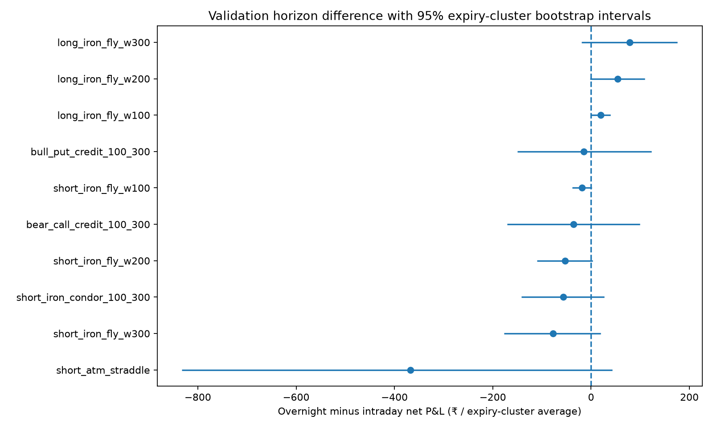
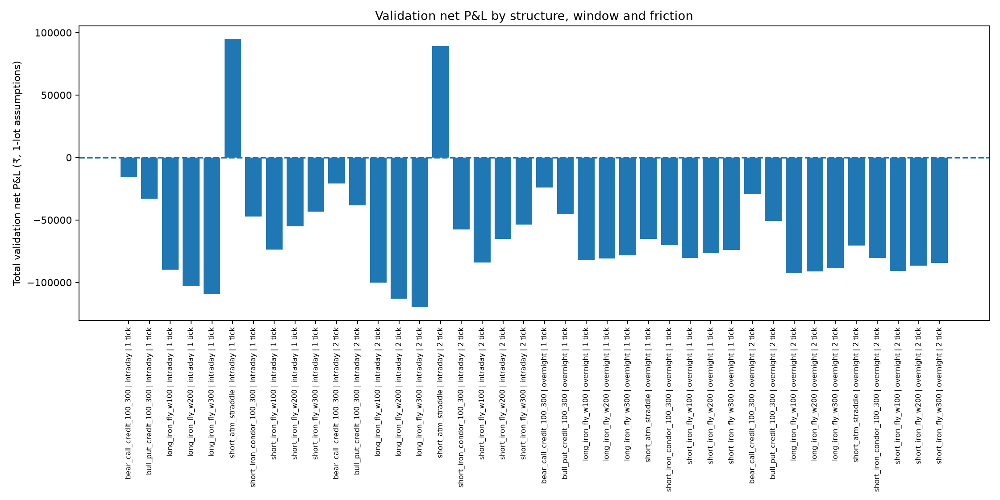

# Phase 82 — Expiry-clustered inference and promotion gate

**Decision: NO_CANDIDATE_GATE_PASS_HOLDOUT_REMAINS_SEALED.**
The 2026 holdout was not read because no defined-risk validation candidate passed the pre-registered two-tick promotion gate.

## Integrity and inferential design
- Phase 81 source: thetrademarkk/india-index-options-1m pinned to 0f4800e43e6f96cec0794369d78eb4d3c4211ef5; corrected Phase 81 workflow run 38044579698.
- Input rows: 22,326 trade rows and 11,163 paired date×variant differences. No 2026 dates or non-DEV/VAL split was accepted.
- 60 validation hypotheses were Holm-adjusted as one family: 40 profitability tests and 20 two-sided horizon differences.
- Bootstrap resamples expiry clusters (20,000 iterations; fixed seed 820026); the estimand gives each expiry cluster equal weight.
- Brokerage is assumed ₹10 per executed order, with modeled historical statutory charges and adverse ₹0.05/tick and ₹0.10/two-tick fills. OHLC is not quote/depth evidence.

## Validation profitability result
| Structure | Window | Friction | Trades | Expiries | Total net (₹) | Mean per trade (₹) | 95% cluster-bootstrap CI for equal-expiry mean (₹) | Raw p | Holm p |
|---|---|---:|---:|---:|---:|---:|---:|---:|---:|
| bear_call_credit_100_300 | intraday | 1 tick | 481 | 104 | -15778.50 | -32.80 | [-151.56, 126.54] | 0.5676 | 1 |
| bear_call_credit_100_300 | intraday | 2 tick | 481 | 104 | -20926.25 | -43.51 | [-162.73, 112.83] | 0.6265 | 1 |
| bear_call_credit_100_300 | overnight | 1 tick | 481 | 104 | -24186.66 | -50.28 | [-133.82, 37.27] | 0.8586 | 1 |
| bear_call_credit_100_300 | overnight | 2 tick | 481 | 104 | -29334.40 | -60.99 | [-145.08, 25.47] | 0.9058 | 1 |
| bull_put_credit_100_300 | intraday | 1 tick | 481 | 104 | -33110.88 | -68.84 | [-190.88, 36.01] | 0.9051 | 1 |
| bull_put_credit_100_300 | intraday | 2 tick | 481 | 104 | -38263.62 | -79.55 | [-202.30, 25.93] | 0.9321 | 1 |
| bull_put_credit_100_300 | overnight | 1 tick | 481 | 104 | -45508.47 | -94.61 | [-182.27, -6.87] | 0.9783 | 1 |
| bull_put_credit_100_300 | overnight | 2 tick | 481 | 104 | -50661.21 | -105.32 | [-192.16, -15.00] | 0.9876 | 1 |
| long_iron_fly_w100 | intraday | 1 tick | 480 | 104 | -89747.35 | -186.97 | [-209.44, -172.24] | 1 | 1 |
| long_iron_fly_w100 | intraday | 2 tick | 480 | 104 | -100032.84 | -208.40 | [-231.81, -193.04] | 1 | 1 |
| long_iron_fly_w100 | overnight | 1 tick | 480 | 104 | -82387.80 | -171.64 | [-183.04, -159.62] | 1 | 1 |
| long_iron_fly_w100 | overnight | 2 tick | 480 | 104 | -92673.29 | -193.07 | [-205.37, -180.14] | 1 | 1 |
| long_iron_fly_w200 | intraday | 1 tick | 482 | 104 | -102759.58 | -213.19 | [-271.04, -176.25] | 1 | 1 |
| long_iron_fly_w200 | intraday | 2 tick | 482 | 104 | -113075.06 | -234.60 | [-293.32, -196.87] | 1 | 1 |
| long_iron_fly_w200 | overnight | 1 tick | 482 | 104 | -80947.03 | -167.94 | [-202.50, -134.22] | 1 | 1 |
| long_iron_fly_w200 | overnight | 2 tick | 482 | 104 | -91262.52 | -189.34 | [-224.55, -155.58] | 1 | 1 |
| long_iron_fly_w300 | intraday | 1 tick | 481 | 104 | -109465.08 | -227.58 | [-325.83, -160.91] | 1 | 1 |
| long_iron_fly_w300 | intraday | 2 tick | 481 | 104 | -119770.57 | -249.00 | [-346.77, -182.78] | 1 | 1 |
| long_iron_fly_w300 | overnight | 1 tick | 481 | 104 | -78409.38 | -163.01 | [-224.20, -102.22] | 1 | 1 |
| long_iron_fly_w300 | overnight | 2 tick | 481 | 104 | -88714.87 | -184.44 | [-245.42, -124.25] | 1 | 1 |
| short_atm_straddle | intraday | 1 tick | 482 | 104 | 94623.19 | 196.31 | [-36.07, 472.67] | 0.04512 | 1 |
| short_atm_straddle | intraday | 2 tick | 482 | 104 | 89465.45 | 185.61 | [-49.90, 458.19] | 0.05321 | 1 |
| short_atm_straddle | overnight | 1 tick | 482 | 104 | -65237.64 | -135.35 | [-540.46, 129.28] | 0.7939 | 1 |
| short_atm_straddle | overnight | 2 tick | 482 | 104 | -70395.38 | -146.05 | [-545.41, 117.85] | 0.8107 | 1 |
| short_iron_condor_100_300 | intraday | 1 tick | 480 | 104 | -47299.71 | -98.54 | [-154.26, -18.80] | 0.9922 | 1 |
| short_iron_condor_100_300 | intraday | 2 tick | 480 | 104 | -57585.20 | -119.97 | [-175.75, -40.56] | 0.9987 | 1 |
| short_iron_condor_100_300 | overnight | 1 tick | 480 | 104 | -70288.97 | -146.44 | [-198.71, -87.85] | 1 | 1 |
| short_iron_condor_100_300 | overnight | 2 tick | 480 | 104 | -80574.47 | -167.86 | [-221.11, -110.46] | 1 | 1 |
| short_iron_fly_w100 | intraday | 1 tick | 480 | 104 | -73722.01 | -153.59 | [-167.21, -131.63] | 1 | 1 |
| short_iron_fly_w100 | intraday | 2 tick | 480 | 104 | -84007.50 | -175.02 | [-188.99, -152.72] | 1 | 1 |
| short_iron_fly_w100 | overnight | 1 tick | 480 | 104 | -80662.48 | -168.05 | [-180.62, -154.81] | 1 | 1 |
| short_iron_fly_w100 | overnight | 2 tick | 480 | 104 | -90947.97 | -189.47 | [-203.16, -175.25] | 1 | 1 |
| short_iron_fly_w200 | intraday | 1 tick | 482 | 104 | -54960.93 | -114.03 | [-150.63, -55.94] | 1 | 1 |
| short_iron_fly_w200 | intraday | 2 tick | 482 | 104 | -65276.41 | -135.43 | [-172.60, -77.49] | 1 | 1 |
| short_iron_fly_w200 | overnight | 1 tick | 482 | 104 | -76389.62 | -158.48 | [-193.09, -121.88] | 1 | 1 |
| short_iron_fly_w200 | overnight | 2 tick | 482 | 104 | -86705.11 | -179.89 | [-214.78, -143.22] | 1 | 1 |
| short_iron_fly_w300 | intraday | 1 tick | 481 | 104 | -43276.87 | -89.97 | [-154.85, 6.95] | 0.9589 | 1 |
| short_iron_fly_w300 | intraday | 2 tick | 481 | 104 | -53582.36 | -111.40 | [-178.43, -12.83] | 0.9874 | 1 |
| short_iron_fly_w300 | overnight | 1 tick | 481 | 104 | -73958.19 | -153.76 | [-213.92, -90.76] | 1 | 1 |
| short_iron_fly_w300 | overnight | 2 tick | 481 | 104 | -84263.67 | -175.18 | [-237.52, -111.36] | 1 | 1 |

## Paired overnight-minus-intraday result (primary one-tick scenario)
| Structure | Daily pairs | Expiries | Total paired difference (₹) | Mean daily diff (₹) | Equal-expiry mean (₹) | 95% cluster-bootstrap CI (₹) | Raw p | Holm p | Fraction of daily pairs with overnight better |
|---|---:|---:|---:|---:|---:|---:|---:|---:|---:|
| bear_call_credit_100_300 | 481 | 104 | -8408.15 | -17.48 | -35.43 | [-170.91, 99.31] | 0.6103 | 1 | 0.474 |
| bull_put_credit_100_300 | 481 | 104 | -12397.59 | -25.77 | -15.17 | [-149.76, 123.34] | 0.8283 | 1 | 0.418 |
| long_iron_fly_w100 | 480 | 104 | 7359.55 | 15.33 | 19.21 | [-0.70, 39.58] | 0.06646 | 1 | 0.569 |
| long_iron_fly_w200 | 482 | 104 | 21812.54 | 45.25 | 54.05 | [-2.21, 109.59] | 0.06332 | 1 | 0.602 |
| long_iron_fly_w300 | 481 | 104 | 31055.69 | 64.56 | 78.45 | [-19.63, 175.87] | 0.1213 | 1 | 0.593 |
| short_atm_straddle | 482 | 104 | -159860.83 | -331.66 | -367.19 | [-832.30, 43.12] | 0.1058 | 1 | 0.388 |
| short_iron_condor_100_300 | 480 | 104 | -22989.26 | -47.89 | -56.72 | [-141.73, 26.83] | 0.1901 | 1 | 0.412 |
| short_iron_fly_w100 | 480 | 104 | -6940.47 | -14.46 | -18.27 | [-38.50, 1.27] | 0.07478 | 1 | 0.446 |
| short_iron_fly_w200 | 482 | 104 | -21428.69 | -44.46 | -53.22 | [-110.03, 3.31] | 0.06744 | 1 | 0.400 |
| short_iron_fly_w300 | 481 | 104 | -30681.32 | -63.79 | -77.65 | [-177.08, 19.42] | 0.125 | 1 | 0.410 |

## Candidate gate
- Defined-risk candidate/window rows assessed at two-tick stress: 18.
- Defined-risk rows with positive total validation net P&L at two-tick stress: 0.
- Candidates passing the full frozen gate: 0.
- Naked short ATM straddle is always excluded from promotion, even if its intraday net summary is positive.

## Figures
- 
- 

## Interpretation and next step
A statistically different holding window is not the same as a profitable strategy. The promotion gate requires positive stress-net outcome, a positive lower bootstrap bound and Holm-adjusted significance, in addition to defined risk and coverage. If no candidate passes, move to the final manuscript phase without opening the holdout; do not expand the strategy universe after looking at the results.

## Limitations
- Tests address the registered 60-hypothesis Phase 82 family, not every prior project experiment.
- Expiry clustering does not eliminate correlation across expiries caused by long-lived market regimes.
- Price references are OHLC opens with adverse ticks; there is no historical bid/ask/depth or market impact model.
- Phase 81 tested ten frozen variants, not every possible strategy combination.
- Bhat et al. (2024) studied delta-hedged returns; this experiment tested static structures.
