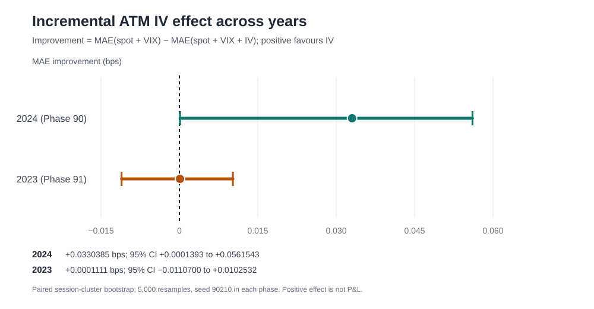
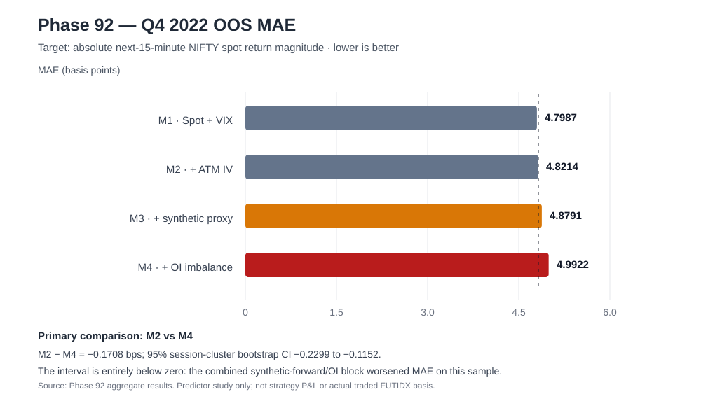

# Rolling ATM Implied Volatility, Synthetic-Forward Proxies, and Open Interest in Short-Horizon NIFTY Spot-Move Prediction: A Preregistered Multi-Year Out-of-Sample Assessment

**Manuscript status:** Research synthesis draft  
**Research programme:** Final Stand v5 1-1-1  
**Evidence window:** phases 89–92; historical data samples 2022–2025  
**Date prepared:** 10 October 2026  
**Strategy status:** No strategy promoted. This manuscript reports forecasting/predictor evidence, not executable trading evidence.

## Abstract

### Background
Option-implied volatility, option open interest (OI), and put–call relationships are used in financial-market research as possible sources of information about future volatility and returns. Evidence is market-, frequency-, and target-dependent. Short-horizon NIFTY forecasting raises an additional distinction between a signal’s association with future spot movement and a model’s incremental predictive utility after baseline spot and volatility information is known.

### Methods
Four preregistered studies were completed using Dhan’s rolling-ATM NIFTY options endpoint and historical India VIX candles. Phase 89 analysed feature associations on the 2025 sample with session-clustered standard errors and Holm correction for a four-test family. Phase 90 compared frozen spot-only, spot-plus-VIX, and spot-plus-VIX-plus-IV models on a distinct 2024 sample. Phase 91 replicated the IV model comparison using 2023 data. Phase 92 evaluated a fixed 2022 feature block comprising a rolling-ATM synthetic-forward proxy gap, (K+C-P) relative to spot, and CALL/PUT OI imbalance. In Phases 90–92, models were fit on January–June, July–September was report-only validation, and October–December was confirmatory out-of-sample (OOS). The primary comparisons used paired trading-session-cluster bootstrap intervals, 5,000 resamples, seed 90210.

### Results
In Phase 89, mean ATM CALL/PUT IV was positively associated with absolute next-15-minute NIFTY spot return (standardized-feature coefficient 0.602 basis points per standard deviation; 95% clustered CI 0.225 to 0.980; Holm-adjusted (p=0.00706)). The other three preregistered feature tests were not significant after Holm correction. In Phase 90, adding IV after spot features and India VIX reduced OOS mean absolute error (MAE) by 0.0330385 basis points (95% bootstrap CI 0.0001393 to 0.0561543), a very small effect. In Phase 91, the same comparison on the independent 2023 period produced only 0.0001111 bps improvement (95% CI −0.0110700 to 0.0102532), so the 2024 result did not replicate. In Phase 92, the combined synthetic-forward/OI feature block worsened MAE relative to the spot-plus-VIX-plus-IV baseline by 0.1708363 bps (95% CI −0.2298769 to −0.1152015). Phase 92 data, VIX, and sample gates passed.

### Conclusions
The studies do not establish a reliable, temporally replicable incremental predictor edge from rolling-ATM IV, nor did the 2022 synthetic-forward/OI block improve the registered spot-magnitude forecast. None of the phases tests option-strategy profit-and-loss, direction, causal mechanism, actual futures basis, executable fills, bid/ask/depth, or cost-adjusted returns. The rolling-ATM predictor line is closed at Phase 92’s preregistered stopping boundary. No strategy is recommended for live trading.

**Keywords:** NIFTY; implied volatility; open interest; India VIX; synthetic forward; forecast evaluation; out-of-sample validation; multiple testing.

---

## 1. Introduction

Short-horizon options research often combines realized spot movement, market volatility, option-implied features, and trading-position proxies. The key methodological challenge is not simply finding a correlation. A candidate feature should demonstrate out-of-sample information beyond a defensible baseline, survive multiplicity-aware inference where appropriate, and ultimately prove relevant to the target decision. A relationship with absolute spot-return magnitude is not the same as a prediction of direction, and neither is an options strategy return.

The literature provides a useful but qualified basis for examining option-derived information. Poon and Granger’s review covers historical and option-implied approaches to volatility forecasting and highlights issues in forecast evaluation, frequency, extreme observations, and measurement of realized volatility ([Poon & Granger, 2003](https://doi.org/10.1257/002205103765762743)). Christensen and Prabhala (1998) found that implied volatility outperformed past volatility for future volatility in their S&P 100 setting, but those results concern a different market and volatility horizon ([DOI](https://doi.org/10.1016/S0304-405X(98)00034-8)). Christoffersen, Jacobs, and Chang (2013) review the use of implied volatility, skewness, kurtosis, and option-implied densities as forecasting inputs, and discuss adjustments for risk premia ([DOI](https://doi.org/10.1016/B978-0-444-53683-9.00010-4)). These findings motivate testing IV, but do not prescribe that it improves five-minute-to-fifteen-minute NIFTY forecasting.

OI is similarly context-dependent. Fodor, Krieger, and Doran (2011) report that changes in option OI can forecast subsequent equity returns in their sample, with relationships depending on the OI feature and controls ([DOI](https://doi.org/10.1007/s11408-011-0164-z)). Jena, Tiwari, and Mitra (2019) study Indian-market put–call ratios and report horizon-dependent results, with volume-based PCR and OI-based PCR behaving differently across horizons ([DOI](https://doi.org/10.3390/economies7010024)). Neither result demonstrates that contemporaneous rolling-ATM CE/PE OI imbalance predicts the magnitude of the next fifteen-minute NIFTY spot move.

A synthetic-forward relationship requires additional caution. Standard put–call parity for futures requires a call and put with the same strike, expiration, and underlying futures contract; the familiar futures relation is not established merely by subtracting two rolling-ATM option bar closes ([CME Group, Put–Call Parity](https://www.cmegroup.com/education/courses/introduction-to-options/put-call-parity.html)). The feature evaluated in Phase 92 is therefore named a **synthetic-forward proxy**, not a traded futures quote, a parity residual, or an arbitrage signal.

Finally, feature exploration is vulnerable to selection effects. Harvey, Liu, and Zhu (2016) explain why repeated factor discovery requires higher evidentiary standards than conventional single-test thresholds ([DOI](https://doi.org/10.1093/rfs/hhv059)). Forecast comparison also requires an explicit loss function and inferential method; Diebold and Mariano (1995) formalize comparison of competing forecast accuracy ([DOI](https://doi.org/10.1080/07350015.1995.10524599)). This programme consequently uses frozen splits, a single primary comparison in Phases 90–92, session-cluster bootstrap intervals, and a finite stopping rule.

## 2. Research questions and objectives

### 2.1 Research questions

1. **Association:** In the rolling-ATM representation, are mean IV, IV skew, CE/PE OI imbalance, or recent OI change associated with the next fifteen-minute NIFTY spot return on the fixed 2025 sample?
2. **Incremental IV value:** Does adding mean ATM CALL/PUT IV improve prediction of absolute next-fifteen-minute spot return beyond lagged spot-movement features and India VIX on the 2024 OOS sample?
3. **Temporal replication:** Does the Phase 90 IV result replicate on a separate 2023 sample under the same model family and fixed split structure?
4. **Additional factors:** Do a one-bar-lagged rolling-ATM synthetic-forward proxy gap and CE/PE OI imbalance add value beyond spot, India VIX, and IV on the 2022 sample?

### 2.2 Objectives

- Evaluate association and incremental predictive value as separate questions.
- Retain chronological DEV, validation, and confirmatory OOS partitions.
- Reduce selection and leakage risks with frozen model definitions, multiplicity correction for Phase 89, and a single primary endpoint for Phases 90–92.
- Quantify the uncertainty of paired forecast-error differences using trading-session clusters.
- Document data-quality exclusions and API coverage, including the Phase 89 single-window timeout and the Phase 92 weekend-only empty window.
- Explicitly separate predictor evidence from executable options-strategy evidence.

## 3. Literature review

### 3.1 Option-implied volatility as forecasting information

Poon and Granger (2003) reviewed dozens of studies comparing historical volatility forecasts with option-implied estimates and emphasized that forecast rankings depend on the object measured, sampling frequency, evaluation method, and data characteristics. Christensen and Prabhala (1998) found that implied volatility can outperform past realized volatility for future volatility in a longer S&P 100 sample. The broader review by Christoffersen, Jacobs, and Chang (2013) describes how option-implied information may be used for various forecast objects, including volatility, distributional shape, covariance, and returns, while noting the possible role of risk premia.

**Implication for this study:** prior evidence makes IV a credible candidate, but not a guaranteed short-horizon NIFTY signal. The local target here is the magnitude of the next fifteen-minute **spot** return, not future realized volatility over a conventional option horizon or a position’s P&L. Phase 89’s positive association is compatible with IV tracking expected movement, yet Phases 90–91 show that its incremental forecast utility over lagged spot and VIX was tiny and not independently replicated.

### 3.2 OI and put–call indicators

Fodor et al. (2011) report a predictive relationship between changes in option OI and subsequent equity returns, with the details varying by CALL versus PUT OI and the controls used. Jena et al. (2019) examine Indian put–call ratios in the frequency domain and conclude that which PCR measure appears predictive depends on the horizon. These studies motivate testing OI, but they do not imply a universal sign or horizon-independent signal. OI records outstanding positions/contracts, not whether a position was opened to buy or sell exposure, and a rolling-strike imbalance can be affected by which strikes are included.

**Implication for this study:** Phase 89’s OI imbalance and stable-strike recent OI-change tests were not significant after multiplicity correction. Phase 92 tested a different, same-time CE/PE OI ratio as part of a block added to an already fitted predictor; that block worsened the fixed OOS MAE. This does not refute all OI research, since the market, horizon, representation, and target differ. It rejects this particular incremental feature block for the fixed sample and model.

### 3.3 Synthetic forwards, parity and market data quality

Put–call parity can imply a forward relationship under matched-contract assumptions. CME’s educational explanation explicitly requires the same strike, expiration and underlying futures contract. Phase 92 had rolling ATM CALL/PUT candle fields, strike, spot, IV, and OI, but not a matched exact traded FUTIDX contract with the full contract identity and execution quotes for every timestamp. Consequently, (F_{syn}=K+C-P) is evaluated as a lagged proxy feature only. Its normalized gap may reflect ATM roll, maturity/carry, bar-price noise or mismatch between the rolling-option representation and a true forward; the data cannot identify these components separately.

India VIX is a near-term volatility index computed from NIFTY options’ best bid/ask prices and represents annualized expected volatility over roughly the next 30 calendar days ([NSE India VIX description](https://www.nseindia.com/static/products-services/indices-indiavix-index)). It is used here as a baseline information variable, not as a complete substitute for intraday quotes or exact-contract volatility surfaces.

### 3.4 Multiple testing and forecast evaluation

Phase 89 had four registered primary feature tests and applied Holm correction to that test family. This controls the family-wise error rate for that declared family, but it does not correct all exploratory decisions that may have occurred in a larger research programme. Harvey, Liu, and Zhu (2016) explain why repeated factor discovery increases false-positive risk and raises the bar for new findings. The later phases accordingly use chronological OOS evaluation, a fixed primary error-difference endpoint, and no OOS tuning.

Diebold and Mariano (1995) discuss formal comparison of forecast accuracy under general loss functions and correlated forecast errors. Phases 90–92 use a paired session-cluster bootstrap of the forecast MAE difference instead of interpreting coefficient significance as proof of forecast utility. Whole trading sessions are the resampling units so within-session dependence is retained in resampled blocks. The resulting intervals are uncertainty estimates conditional on the chosen model, sample, endpoint and resampling procedure; they are not a guarantee of performance in future markets.

### 3.5 Research gap

The studies identified above do not answer whether the exact rolling-ATM feature definitions used here improve a fixed linear NIFTY spot-magnitude predictor at a fifteen-minute horizon. This programme addresses that narrow empirical question with fixed chronological samples. It does not seek to reproduce every finding in the literature, claim causal information flow, or validate strategy profitability.

## 4. Data and provenance

### 4.1 Source and sampling

Phases 89–92 used Dhan’s documented rolling-ATM options history endpoint and historical intraday candles for India VIX. The Dhan documentation describes historical/expired rolling-option fields such as OHLC, IV, volume, OI, strike and spot, a maximum request range per call, and a non-inclusive `toDate` ([Dhan expired-options API](https://dhanhq.co/docs/v2/expired-options-data/); [historical data API](https://dhanhq.co/docs/v2/historical-data/)). The API returns an ATM-relative rolling representation; a series of rows does not establish one continuously unchanged listed contract.

Calendar periods:
- Phase 89: 2025-01-01 inclusive through 2026-01-01 exclusive.
- Phase 90: 2024-01-01 inclusive through 2025-01-01 exclusive.
- Phase 91: 2023-01-01 inclusive through 2024-01-01 exclusive.
- Phase 92: 2022-01-01 inclusive through 2023-01-01 exclusive.

India VIX security identity was resolved dynamically from the instrument master in Phases 90–92, requiring one unique match. For Phase 92, its identifier was resolved at runtime rather than hardcoded into the analysis.

### 4.2 Coverage and quality filters

Across the studies, the pipeline checked requested response-array alignment, timestamp deduplication and date bounds, exact CALL/PUT timestamp pairing, spot consistency and strike matching. Phase 89 had one CALL window timeout (25/26 valid windows) and additional spot/strike exclusions; Phase 90 had 54/54 option and 5/5 VIX windows; Phase 91 had 54/54 and 5/5; and Phase 92 finished with 54/54 options and 5/5 VIX windows after recording the 2022-12-31 to 2023-01-01 interval as an aligned zero-row interval containing no weekday trading session. No rows were imputed.

Phase-specific aggregate ledgers record excluded mismatches and source-window statuses. Raw API responses/row-level data were retained in Actions cache for the relevant phase and were not committed or published as raw files.

## 5. Methodology

### 5.1 Phase 89: preregistered feature-association screen

Phase 89 tested four features on the fixed 2025 sample:
- mean ATM CALL/PUT IV → absolute next-15-minute NIFTY spot return;
- PUT IV minus CALL IV → signed next-15-minute spot return;
- CE/PE OI imbalance ((OI_C-OI_P)/(OI_C+OI_P)) → signed return;
- trailing fifteen-minute percentage change in total CE+PE OI → signed return, with the stable-strike audit applied.

Each test used date/session-clustered standard errors and a two-sided test. Holm adjustment was applied across the frozen four-test OOS family. The endpoint is an association screen and the coefficient is interpreted as a predictive association, not as causality.

### 5.2 Phases 90–91: incremental IV model comparison

The frozen models were:
- **M0 — spot/time:** trailing absolute realized movement over 15 and 60 minutes, signed spot returns over 15 and 60 minutes, and time-of-day sine/cosine.
- **M1 — spot + VIX:** M0 plus India VIX level and trailing fifteen-minute VIX change.
- **M2 — spot + VIX + IV:** M1 plus mean ATM CALL/PUT IV.

The target was the absolute forward fifteen-minute NIFTY spot return in basis points:
[
Y_t=left|left(S_{t+15}/S_t-1
ight)	imes10{,}000
ight|.
]
Forward targets were retained only where a matching observation existed exactly fifteen minutes later in the same session with no interval gap. Features and model parameters were standardized/estimated on DEV only; negative predictions were clipped to zero. Validation was a reporting split and did not influence tuning or feature choice.

Splits per year: DEV January–June; validation July–September; OOS October–December. Phase 90’s single primary statistic was MAE(M1)−MAE(M2). Phase 91 used the same statistic on 2023’s distinct annual sample. Positive values mean adding IV improved MAE.

### 5.3 Phase 92: synthetic-forward proxy and OI

Phase 92 compared:
- **M0:** spot/time features;
- **M1:** M0 + India VIX level and change;
- **M2:** M1 + mean ATM CALL/PUT IV;
- **M3:** M2 + the prior completed five-minute bar’s synthetic-forward proxy gap;
- **M4:** M3 + the prior completed bar’s CE/PE OI imbalance.

The proxy was:
[
F^{proxy}_t=K_t+C_t-P_t,qquad
g_t=10{,}000rac{F^{proxy}_t-S_t}{S_t}.
]
OI imbalance was:
[
OIratio_t=rac{OI_{CE,t}-OI_{PE,t}}{OI_{CE,t}+OI_{PE,t}},
]
defined only for a positive denominator.

To reduce look-ahead risk, option close-derived synthetic proxy, IV and OI features were lagged one complete five-minute row. VIX close was also conservatively lagged one row. CALL and PUT strikes had to agree at the paired timestamp. All models were fitted on DEV only and scored on exactly the same complete rows. There was no imputation.

### 5.4 Primary inference and acceptance rule

The single primary Phase 92 comparison was:
[
Delta MAE = MAE(M2)-MAE(M4).
]
Positive (Delta MAE) favours the block of synthetic-proxy/OI features. A paired trading-session-cluster bootstrap with 5,000 resamples and fixed seed 90210 produced a 95% confidence interval. The registered “gain” decision required the full interval to be above zero; an interval below zero is interpreted as degradation for that sample; an interval spanning zero would not establish an incremental gain. RMSE and OOS (R^2) are secondary forecast metrics. VIX-regime splits are descriptive only and are not separately tested for selection.

### 5.5 Phase 92 quality/sample gates

Acceptance required a unique India VIX instrument-master match; valid lagged VIX coverage of at least 80% in OOS; at least 1,000 complete OOS rows over 30 sessions; at least 1,000 complete DEV rows; and at least 100 validation rows. All passed in the accepted Phase 92 run. The registered sample and primary endpoint were not changed after observing the result.

## 6. Results

### 6.1 Phase 89 feature associations

| Feature / target | OOS N | Sessions | Coefficient (bps per 1 SD) | 95% clustered CI | Raw p | Holm p |
|---|---:|---:|---:|---:|---:|---:|
| Mean ATM IV → absolute forward-15m return | 4,049 | 57 | +0.602 | +0.225 to +0.980 | 0.0018 | 0.0071 |
| PUT IV − CALL IV → signed forward-15m return | 4,049 | 57 | −0.218 | −0.652 to +0.216 | 0.3240 | 0.9720 |
| CE/PE OI imbalance → signed forward-15m return | 4,049 | 57 | −0.118 | −0.567 to +0.330 | 0.6046 | 1.0000 |
| Trailing 15m total OI change → signed forward-15m return | 2,622 | 57 | −0.076 | −0.456 to +0.303 | 0.6931 | 1.0000 |

The mean-IV association survived the registered Holm correction. The other associations did not. Phase 89 had 25/26 valid API window/side responses; the incomplete window is retained as a data-coverage caveat. The coefficient is a feature association within a rolling-ATM representation. It does not demonstrate that IV improves a multivariate predictor or a trading strategy.

### 6.2 Phase 90 IV incremental model result (2024)

| Model | OOS rows | Sessions | MAE (bps) | RMSE (bps) | OOS R² |
|---|---:|---:|---:|---:|---:|
| M0 spot/time | 3,604 | 60 | 6.0338 | 9.2211 | 0.0518 |
| M1 spot + VIX | 3,604 | 60 | 5.9953 | 9.2126 | 0.0536 |
| M2 spot + VIX + IV | 3,604 | 60 | 5.9623 | 9.1920 | 0.0578 |

Primary result: MAE(M1)−MAE(M2) = +0.0330385 bps; paired session-bootstrap 95% CI +0.0001393 to +0.0561543. The relative MAE reduction was about 0.5511%. The point estimate was positive, but the effect was small and the lower bound was close to zero.

### 6.3 Phase 91 independent IV replication (2023)

| Model | OOS rows | Sessions | MAE (bps) | RMSE (bps) | OOS R² |
|---|---:|---:|---:|---:|---:|
| M0 spot/time | 3,633 | 60 | 4.0192 | 5.5626 | 0.0563 |
| M1 spot + VIX | 3,633 | 60 | 3.9156 | 5.5163 | 0.0719 |
| M2 spot + VIX + IV | 3,633 | 60 | 3.9155 | 5.5135 | 0.0729 |

Primary result: MAE(M1)−MAE(M2) = +0.0001111 bps; 95% CI −0.0110700 to +0.0102532. The 2023 increment was effectively zero and the interval spanned both harm and benefit. The registered rule did not establish incremental IV predictive value. This is a non-replication of the small 2024 result, not proof that no possible IV feature is useful in any target or market.

### 6.4 Phase 92 synthetic-forward/OI result (2022)

| Model | OOS rows | Sessions | MAE (bps) | RMSE (bps) | OOS R² |
|---|---:|---:|---:|---:|---:|
| M0 spot/time | 3,660 | 61 | 5.4719 | 6.9444 | −0.0269 |
| M1 spot + VIX | 3,660 | 61 | 4.7987 | 6.6109 | 0.0693 |
| M2 spot + VIX + IV | 3,660 | 61 | 4.8214 | 6.6003 | 0.0723 |
| M3 M2 + synthetic-forward proxy | 3,660 | 61 | 4.8791 | 6.6208 | 0.0665 |
| M4 M3 + OI imbalance | 3,660 | 61 | 4.9922 | 6.6615 | 0.0550 |

Coverage gates: 54/54 option windows valid; 5/5 VIX windows valid. Paired CALL/PUT rows: 18,579 across 248 sessions, zero spot mismatches, one mismatched strike excluded. Complete OOS sample: 3,660 rows / 61 sessions; OOS VIX coverage 98.63%; DEV and validation sample gates passed.

Primary MAE(M2)−MAE(M4) = −0.1708363 bps, with 95% paired session-cluster bootstrap CI −0.2298769 to −0.1152015 and 0/5,000 positive bootstrap estimates. Because the entire interval lies below zero, the added feature block worsened the registered loss function on this sample. M3 already worsened MAE versus M2 by approximately 0.0577 bps; M4’s MAE was worse by approximately 0.1708 bps. No P&L calculation was conducted.

## 7. Discussion

### 7.1 Interpretation across the four phases

The evidence follows a sequence from association to incremental model utility. Phase 89 first detected a positive association between mean rolling ATM IV and absolute next-fifteen-minute spot movement. Association, however, does not show whether the information is incremental to lagged spot movement and an observable volatility-regime feature. Phase 90’s frozen 2024 predictor yielded a positive MAE difference favouring IV, but its magnitude was extremely small. Phase 91’s separate 2023 test produced no meaningful improvement, so that incremental result did not replicate. Phase 92 then evaluated a different block of features and found that adding its rolling-ATM synthetic-forward proxy and OI imbalance worsened the target’s OOS MAE.

These results are consistent with the literature’s broad caution: predictive utility depends on target, horizon, market, model and data representation. The positive Phase 89 association need not contradict the Phase 91 non-replication because Phase 89 was a feature/target regression association and Phase 91 compared the loss of two multivariate predictors. Likewise, Phase 92 did not test actual futures basis or a parity residual, and its negative finding should not be overgeneralized to all futures or OI features.

### 7.2 Why this is not a trading signal

The target is (|R_{t,t+15m}|), not the signed return. A better forecast of magnitude would not directly indicate CALL versus PUT, directional positioning, a straddle/strangle entry, or the timing and strike for an options strategy. A less-error-prone spot-magnitude forecast is not automatically monetizable after option repricing, theta, volatility risk premium, market microstructure and transaction costs.

The data is a rolling-ATM representation. As the ATM strike rolls, a CALL/PUT row at a later timestamp may refer to a different listed contract. The (K+C-P) feature built from rolling bar closes is consequently only a proxy. Standard put–call parity requires same-strike, same-expiry options on the same underlying futures contract; the present feature does not establish those conditions. The current tests cannot infer an actual FUTIDX basis or arbitrage opportunity.

### 7.3 Consequences for next research steps

A further blind search across more years or more features would risk data mining after the outcome is visible. The registered stop was one distinct replication for IV and one bounded feature screen for the synthetic-proxy/OI block. That stop is now reached. A future study should require a materially new economic hypothesis or improved authorized data capable of identifying exact listed contracts and historical executable quotes. It should not repeat previously rejected metadata-only source searches.

Any future strategy-level evaluation must define exact contract selection, order timing, fill logic, Paytm Money brokerage, statutory levies, bid/ask spread, adverse slippage, latency, market impact and stress-cost scenarios before OOS analysis. It must preserve the untouched Phase 83 2026 holdout. No such cost-adjusted strategy test is claimed here.

## 8. Strengths

- **Temporal separation:** Phases 90–92 used fixed chronological DEV, validation, and OOS samples; the same year was not reused as a purported independent replication.
- **Explicit baseline comparison:** Phase 90/91 tested incremental value beyond spot features and India VIX rather than relying only on a univariate feature coefficient.
- **Registered primary comparisons:** Phases 90–92 used one primary MAE-difference statistic with a fixed-seed paired session-cluster bootstrap.
- **Multiplicity control in Phase 89:** the four preregistered association tests were Holm-adjusted.
- **Quality accounting:** CALL/PUT timestamp/spot/strike checks, window coverage and VIX security resolution were recorded.
- **Point-in-time mitigation in Phase 92:** bar-close-derived features and VIX were lagged a full five-minute row.
- **Transparent negative evidence:** non-replication, negative incremental results, a timeout, and an empty weekend-only window are documented rather than suppressed.
- **Finite stop rule:** no further year sweep was conducted after the planned replication and feature screen.

## 9. Limitations

1. **No strategy P&L:** the target is spot-move magnitude. There is no options-strategy entry/exit simulation, no actual futures trade, and no transaction-cost-adjusted return.
2. **Rolling contract identity:** rolling ATM fields do not reconstruct a stable listed option contract across time. The synthetic-forward proxy is not actual FUTIDX price.
3. **No historical bid/ask/depth validation:** exact executable option quotes, displayed quantities, fill probability and latency were not available to this pipeline.
4. **Finite periods/model class:** three OOS annual periods and a small linear regression family cannot characterize all regimes, horizons, feature forms or future markets.
5. **Phase 89 coverage caveat:** one of 26 option windows timed out; several tests had different complete-case counts.
6. **Model and bootstrap assumptions:** cluster bootstrapping by session preserves intraday grouping but results remain conditional on the observed sessions and fixed model.
7. **No inference on regime subgroups:** the VIX regime breakdowns are descriptive and should not guide model/strategy selection.
8. **OI interpretation:** CE/PE OI ratios are not direct measures of bullish/bearish intent; trades can create or close OI for differing reasons.
9. **Synthetic proxy confounding:** (K+C-P) may mix strike rolls, maturity/carry and noisy bar-price effects; exact expiry and risk-free/carry assumptions were not supplied in a form that establishes a valid parity residual.
10. **Generalization:** findings do not imply that all implied-volatility, OI, Greeks, futures, news or sentiment features lack value.

## 10. Conclusion

Across this fixed sequence, rolling ATM IV showed a statistically supported association with absolute spot movement in the 2025 association screen, but its small 2024 incremental OOS gain did not replicate on the independent 2023 sample. Adding the 2022 rolling-ATM synthetic-forward proxy gap and OI imbalance worsened prediction of the same spot-magnitude target relative to the spot+VIX+IV baseline. The program therefore does not establish a reliable incremental predictor edge from this feature line.

The scientific conclusion is narrow: these feature definitions and models did not produce robust temporally replicable incremental out-of-sample value under the registered tests. This does not prove that all IV/OI/Greeks/futures information is useless. It does mean that the observed estimates should not be converted into a trading rule without a new preregistered hypothesis and much better execution-quality evidence. **No strategy is promoted.**

## 11. Future research directions

Reopen only if one of the following changes materially:

1. A new economic mechanism leads to a specific preregistered hypothesis (e.g., a point-in-time Greeks or order-book feature tied to a defined target), with one primary test and a fixed stop rule.
2. Authorized exact-contract historical data becomes available to reconstruct the actual expiry/strike, bid/ask/depth and timestamp alignment for both options and relevant futures.
3. A complete strategy test can replay exact listed contracts with realistic order timing and fills, Paytm Money brokerage, statutory charges, spread, slippage, latency and cost stress—and pass untouched out-of-sample gates.
4. Independent replication is specified before analysis, including multiplicity control and sufficient session count; no search across years or model variants is performed after looking at OOS results.

The next step is not an automatic expansion of this feature screen. Phase 92’s planned stop is reached. Broader strategy research remains separately gated by the still-unresolved authorized execution-grade data requirement.

## 12. Data, code and reproducibility

The raw market payloads were not committed or published. Phase-specific Actions caches held raw payloads during the automated studies; public results include sanitized window-coverage ledgers, aggregate metrics, summary JSON and reports. The frozen engines and workflows are in each phase branch.

- **Phase 89:** [results](https://github.com/vishnuvcr/Final-Stand-v5-1-1-1/blob/phase-89-rolling-options-feature-study/results/phase89/PHASE89_RESULTS.md) · [run 38047775690](https://github.com/vishnuvcr/Final-Stand-v5-1-1-1/actions/runs/38047775690)
- **Phase 90:** [results](https://github.com/vishnuvcr/Final-Stand-v5-1-1-1/blob/phase-90-iv-incremental-prediction/results/phase90/PHASE90_RESULTS.md) · [run 38048556674](https://github.com/vishnuvcr/Final-Stand-v5-1-1-1/actions/runs/38048556674)
- **Phase 91:** [results](https://github.com/vishnuvcr/Final-Stand-v5-1-1-1/blob/phase-91-iv-temporal-replication-2023/results/phase91/PHASE91_RESULTS.md) · [run 38050932108](https://github.com/vishnuvcr/Final-Stand-v5-1-1-1/actions/runs/38050932108)
- **Phase 92:** [results](PHASE92_RESULTS.md) · [summary JSON](summary.json) · [coverage CSV](coverage.csv) · [model metrics CSV](model_metrics.csv) · [cross-phase synthesis](CROSS_PHASE_FACTOR_SYNTHESIS.md) · [run 38050805106](https://github.com/vishnuvcr/Final-Stand-v5-1-1-1/actions/runs/38050805106)
- [Main README checkpoint](https://github.com/vishnuvcr/Final-Stand-v5-1-1-1/blob/main/README.md)

## Appendix A. Preregistered models and primary endpoints

| Phase | Sample | Model or feature tests | Primary endpoint | Stopping decision |
|---|---|---|---|---|
| 89 | 2025 | Four feature/target associations | Holm-adjusted significance within the frozen four-test family | IV mean association survives; other three tests do not; data coverage caveat documented |
| 90 | 2024 | M0 spot; M1 spot+VIX; M2 spot+VIX+IV | MAE(M1)−MAE(M2) | Very small positive gain; proceed to independent replication |
| 91 | 2023 | Same M0–M2 family as Phase 90 | MAE(M1)−MAE(M2) | CI crosses zero; incremental IV gain not established |
| 92 | 2022 | M0 spot; M1 +VIX; M2 +IV; M3 +synthetic proxy; M4 +OI imbalance | MAE(M2)−MAE(M4) | Entire CI below zero; feature block degrades OOS MAE; close this predictor screen |

## Appendix B. Statistical definitions

- **MAE:** mean absolute forecast error for the nonnegative target, evaluated over the fixed OOS row set.
- **RMSE:** square root of mean squared forecast error; more sensitive to larger errors.
- **(R^2):** standard coefficient of determination for the out-of-sample targets/predictions as emitted by the registered pipeline; it can be negative.
- **Bootstrap interval:** resample trading sessions with replacement, retain all rows within each selected session, and recompute the row-weighted paired MAE difference; 5,000 replicates, seed 90210.
- **Phase 89 Holm correction:** step-down family-wise error adjustment for exactly the four preregistered OOS tests in that phase.
- **Target sign:** all Phase 90–92 primary targets are absolute return magnitudes. A positive primary MAE difference means the augmented model has lower MAE; for Phase 92 the sign convention is explicitly MAE(M2)−MAE(M4), so a positive value would favour added synthetic/OI features.

## Appendix C. Literature referenced

1. Poon, S.-H., & Granger, C. W. J. (2003). Forecasting volatility in financial markets: A review. *Journal of Economic Literature*, 41(2), 478–539. [https://doi.org/10.1257/002205103765762743](https://doi.org/10.1257/002205103765762743)
2. Christensen, B. J., & Prabhala, N. R. (1998). The relation between implied and realized volatility. *Journal of Financial Economics*, 50(2), 125–150. [https://doi.org/10.1016/S0304-405X(98)00034-8](https://doi.org/10.1016/S0304-405X(98)00034-8)
3. Christoffersen, P., Jacobs, K., & Chang, B. Y. (2013). Forecasting with option-implied information. In *Handbook of Economic Forecasting* (Vol. 2A, pp. 581–656). North-Holland. [https://doi.org/10.1016/B978-0-444-53683-9.00010-4](https://doi.org/10.1016/B978-0-444-53683-9.00010-4)
4. Fodor, A., Krieger, K., & Doran, J. S. (2011). Do option open-interest changes foreshadow future equity returns? *Financial Markets and Portfolio Management*, 25(3), 265–280. [https://doi.org/10.1007/s11408-011-0164-z](https://doi.org/10.1007/s11408-011-0164-z)
5. Jena, S. K., Tiwari, A. K., & Mitra, A. (2019). Put–call ratio volume vs. open interest in predicting market return: A frequency domain rolling causality analysis. *Economies*, 7(1), 24. [https://doi.org/10.3390/economies7010024](https://doi.org/10.3390/economies7010024)
6. Harvey, C. R., Liu, Y., & Zhu, H. (2016). … and the cross-section of expected returns. *The Review of Financial Studies*, 29(1), 5–68. [https://doi.org/10.1093/rfs/hhv059](https://doi.org/10.1093/rfs/hhv059)
7. Diebold, F. X., & Mariano, R. S. (1995). Comparing predictive accuracy. *Journal of Business & Economic Statistics*, 13(3), 253–263. [https://doi.org/10.1080/07350015.1995.10524599](https://doi.org/10.1080/07350015.1995.10524599)
8. CME Group. Put-call parity. [https://www.cmegroup.com/education/courses/introduction-to-options/put-call-parity.html](https://www.cmegroup.com/education/courses/introduction-to-options/put-call-parity.html)
9. National Stock Exchange of India. India VIX Index. [https://www.nseindia.com/static/products-services/indices-indiavix-index](https://www.nseindia.com/static/products-services/indices-indiavix-index)
10. Dhan. Expired options data API documentation. [https://dhanhq.co/docs/v2/expired-options-data/](https://dhanhq.co/docs/v2/expired-options-data/)
11. Dhan. Historical data API documentation. [https://dhanhq.co/docs/v2/historical-data/](https://dhanhq.co/docs/v2/historical-data/)
